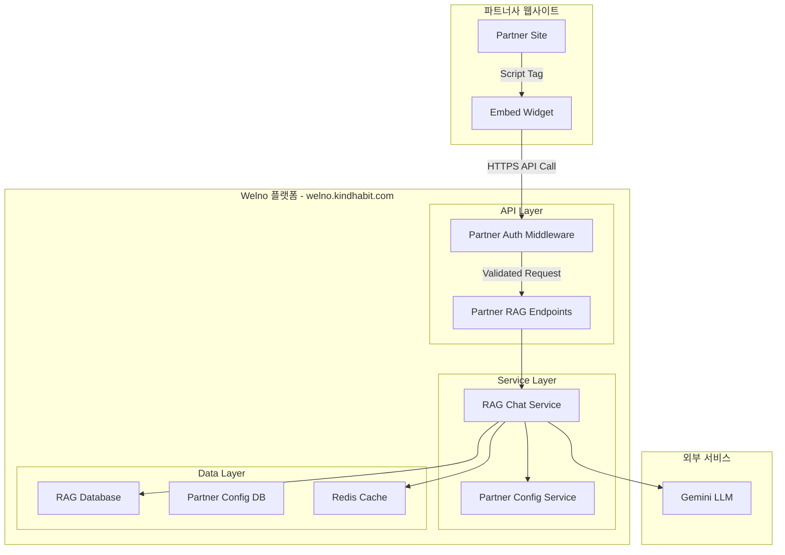

# 🏥 Welno RAG Chat 파트너 통합 완전 가이드

**생성일**: 2026-02-07  
**작업일자**: 2026-02-07  
**작업내용**: Welno RAG Chat 파트너 통합 완전 가이드 (운영·API·위젯)

> **실제 운영 환경**: `welno.kindhabit.com` | **최종 업데이트**: 2026년 2월 7일

---

## 📑 목차

1. [프로젝트 개요](#-프로젝트-개요)
2. [빠른 시작 (5분 완성)](#-빠른-시작-5분-완성)
3. [실제 운영 정보](#-실제-운영-정보)
4. [상세 설정 가이드](#-상세-설정-가이드)
5. [건강 데이터 통합](#-건강-데이터-통합)
6. [API 참조](#-api-참조)
7. [위젯 커스터마이징](#-위젯-커스터마이징)
8. [보안 및 인증](#-보안-및-인증)
9. [테스트 및 검증](#-테스트-및-검증)
10. [문제 해결](#-문제-해결)
11. [구현 완료 현황](#-구현-완료-현황)
12. [지원 및 연락처](#-지원-및-연락처)

---

## 🎯 프로젝트 개요

### 목적
Welno의 RAG 기반 건강상담 채팅 기능을 외부 파트너사에게 API 및 임베드 위젯 형태로 제공하여, 파트너사 고객들이 개인화된 AI 건강 상담을 받을 수 있도록 합니다.

### 지원 기능
- 🤖 **AI 기반 건강상담 채팅**: Google Gemini LLM 기반 전문 상담
- 📊 **파트너 데이터 분석**: 검진 결과와 RAG 지식베이스 통합 분석
- 🎨 **커스터마이징 가능한 UI**: 파트너 브랜딩에 맞는 디자인 적용
- 📱 **모바일 반응형**: 모든 디바이스에서 최적화된 사용자 경험
- 🔒 **보안 강화**: API Key 인증, 도메인 화이트리스트, 데이터 암호화

### 아키텍처


---

## 🚀 빠른 시작 (5분 완성)

### 1단계: API Key 확인
현재 등록된 파트너 API Key:
- **MediLinx**: `5a9bb40b5108ecd8ef864658d5a2d5ab`
- **Test Partner**: `test_pk_12345678901234567890123456789012`

### 2단계: 기본 통합 (MediLinx 예제)

웹사이트의 `</body>` 태그 직전에 다음 코드를 추가하세요:

```html
<!DOCTYPE html>
<html lang="ko">
<head>
    <meta charset="UTF-8">
    <title>MediLinx - 건강 상담</title>
</head>
<body>
    <h1>MediLinx 건강 관리 서비스</h1>
    
    <!-- Welno RAG Chat Widget -->
    <script>
        (function() {
            var script = document.createElement('script');
            script.src = "https://welno.kindhabit.com/welno-api/static/welno-rag-chat-widget.min.js";
            script.async = true;
            script.onload = function() {
                const widget = new WelnoRagChatWidget({
                    apiKey: '5a9bb40b5108ecd8ef864658d5a2d5ab',
                    baseUrl: 'https://welno.kindhabit.com',
                    uuid: 'medilinx_' + Date.now(),
                    hospitalId: 'medilinx_clinic',
                    position: 'bottom-right',
                    buttonColor: '#2E7D32',
                    theme: 'light',
                    welcomeMessage: '안녕하세요! MediLinx 건강 상담 서비스입니다. 궁금한 점을 물어보세요. 🏥'
                });
                widget.init();
            };
            document.body.appendChild(script);
        })();
    </script>
</body>
</html>
```

### 3단계: 테스트
웹사이트를 새로고침하면 우측 하단에 채팅 버튼이 나타납니다. 클릭해서 테스트해보세요!

---

## 🌐 실제 운영 정보

### 도메인 및 URL 정보
- **메인 도메인**: `welno.kindhabit.com`
- **프로토콜**: HTTPS (HTTP는 자동 리다이렉트)
- **파트너 API 엔드포인트**: `https://welno.kindhabit.com/welno-api/v1/rag-chat/partner/message`
- **위젯 스크립트 경로**: `https://welno.kindhabit.com/welno-api/static/welno-rag-chat-widget.min.js`

### NGINX 설정 현황
- **SSL 인증서**: Let's Encrypt 적용 완료
- **라우팅**: Referer 기반 동적 라우팅 (기본: 8082 포트)
- **보안 헤더**: CSP, HSTS, X-Frame-Options 설정 완료
- **정적 파일**: `/welno-api/static/` 경로로 직접 서빙 (추천)

### API 테스트 결과
- ✅ HTTPS 접속 정상
- ✅ API 인증 미들웨어 작동
- ✅ 파트너 RAG 채팅 응답 정상

---

## ⚙️ 상세 설정 가이드

### 필수 설정 옵션

| 옵션 | 타입 | 설명 | 예시 |
|------|------|------|------|
| `apiKey` | string | 파트너 API 키 | `'5a9bb40b5108ecd8ef864658d5a2d5ab'` |
| `baseUrl` | string | Welno API 서버 URL | `'https://welno.kindhabit.com'` |
| `uuid` | string | 환자/사용자 고유 ID | `'patient_12345'` |
| `hospitalId` | string | 병원/클리닉 식별자 | `'medilinx_clinic'` |

### 선택적 설정 옵션

| 옵션 | 타입 | 기본값 | 설명 |
|------|------|--------|------|
| `position` | string | `'bottom-right'` | 위젯 위치 (`'bottom-left'`, `'top-right'`, `'top-left'`) |
| `buttonColor` | string | `'#A69B8F'` | 채팅 버튼 색상 (HEX 코드) |
| `chatIconUrl` | string | (없음, 기본 말풍선 아이콘) | **채팅 아이콘 이미지 URL** – 파트너가 지정한 이미지를 우측 하단 채팅 버튼에 사용 (권장: 24×24 또는 정사각형, PNG/SVG). **MediLinx** API Key 사용 시 미지정이면 메디링스 전용 아이콘(`mdx_icon.png`)이 자동 적용됩니다. |
| `theme` | string | `'default'` | UI 테마: `'default'`(브라운), `'navy'`(남색/파랑). 채팅창 헤더·버튼·강조색이 테마별 토큰으로 적용됩니다. |
| `autoOpen` | boolean | `false` | 페이지 로드 시 자동으로 채팅창 열기 |
| `welcomeMessage` | string | 기본 메시지 | 채팅창을 열 때 표시할 환영 메시지 |

### 고급 설정 예시

```javascript
const welnoChat = new WelnoRagChatWidget({
    // 필수 설정
    apiKey: '5a9bb40b5108ecd8ef864658d5a2d5ab',
    baseUrl: 'https://welno.kindhabit.com',
    uuid: 'patient_' + userId,
    hospitalId: 'medilinx_clinic',
    
    // UI 커스터마이징
    position: 'bottom-left',
    buttonColor: '#2E7D32',
    chatIconUrl: 'https://your-cdn.com/chat-icon.png', // 파트너 지정 채팅 아이콘 (선택)
    theme: 'light',
    autoOpen: false,
    welcomeMessage: '안녕하세요! 건강에 대해 궁금한 점을 물어보세요. 🏥',
    
    // 환자 건강 데이터 (선택적)
    partnerData: {
        patient: {
            name: '홍길동',
            age: 35,
            gender: 'M',
            phone: '010-1234-5678'
        },
        checkup_results: {
            height: 175,
            weight: 70,
            bmi: 22.9,
            blood_pressure: '120/80',
            fasting_glucose: 95,
            total_cholesterol: 180,
            exam_date: '2024-01-15'
        }
    },
    
    // 이벤트 콜백
    onOpen: function() {
        console.log('채팅창이 열렸습니다');
    },
    
    onClose: function() {
        console.log('채팅창이 닫혔습니다');
    },
    
    onMessage: function(message) {
        console.log('새 메시지:', message);
    },
    
    onError: function(error) {
        console.error('위젯 오류:', error);
    }
});

welnoChat.init();
```

---

## 🏥 건강 데이터 통합

### 데이터 전송 권장 사항 (Best Practice)
위젯의 **AI 개인화 인사말** 및 **초고속 응답(Caching)** 기능을 100% 활용하기 위해 다음을 권장합니다:

1.  **환자 성함 포함**: `patient.name` 필드를 포함하면 "최안안님, 안녕하세요!"와 같이 친근한 인사가 나갑니다.
2.  **데이터 일관성**: 페이지 로드 시마다 동일한 `uuid`와 `hospitalId`를 전달해야 대화 맥락이 유지됩니다.
3.  **데이터 세분화**: `checkup_results`에 수치 데이터(혈압, BMI 등)를 포함하면 AI가 즉시 이상 징후를 감지하여 인사말에 반영합니다.

### 지원하는 데이터 형식

#### 1. 기본 환자 정보
```javascript
partnerData: {
    patient: {
        name: '홍길동',           // 환자명
        birth_date: '1988-05-15', // 생년월일 (YYYY-MM-DD)
        age: 35,                  // 나이
        gender: 'M',              // 성별 (M/F)
        phone: '010-1234-5678',   // 연락처
        email: 'hong@email.com'   // 이메일 (선택적)
    }
}
```

#### 2. 검진 결과 데이터
```javascript
partnerData: {
    checkup_results: {
        // 기본 신체 정보
        height: 175,              // 키 (cm)
        weight: 70,               // 체중 (kg)
        bmi: 22.9,               // BMI
        
        // 혈압
        systolic_bp: 120,         // 수축기 혈압
        diastolic_bp: 80,         // 이완기 혈압
        blood_pressure: '120/80', // 또는 문자열 형식
        
        // 혈액 검사
        fasting_glucose: 95,      // 공복혈당 (mg/dL)
        total_cholesterol: 180,   // 총 콜레스테롤 (mg/dL)
        hdl_cholesterol: 50,      // HDL 콜레스테롤 (mg/dL)
        ldl_cholesterol: 110,     // LDL 콜레스테롤 (mg/dL)
        triglycerides: 120,       // 중성지방 (mg/dL)
        
        // 검진 정보
        exam_date: '2024-01-15',  // 검진일
        exam_type: '종합검진'      // 검진 종류
    }
}
```

### 파트너별 데이터 형식

#### MediLinx 형식
```javascript
// MediLinx 파트너는 다음 형식을 사용하세요
partnerData: {
    patient: {
        name: '김환자',
        birth_date: '1985-03-15',
        sex: 'M',  // gender 대신 sex 사용
        phone: '010-1234-5678'
    },
    checkup_results: {
        height: 172,
        weight: 75,
        bmi: 25.3,
        systolic_bp: 135,
        diastolic_bp: 85,
        fasting_glucose: 105,
        total_cholesterol: 220,
        exam_date: '2024-01-20'
    }
}
```

#### KindHabit 형식
```javascript
// KindHabit 파트너는 다음 형식을 사용하세요
partnerData: {
    user_profile: {
        name: '이사용자',
        age: 28,
        gender: 'F'
    },
    health_metrics: {
        weight: 55,
        height: 160,
        body_fat: 22.5,
        muscle_mass: 38.2,
        last_updated: '2024-02-01'
    },
    activity_data: {
        daily_steps: 8500,
        calories_burned: 320,
        active_minutes: 45
    }
}
```

---

## 🔧 API 참조

### 엔드포인트 목록

#### 1. 파트너 상태 확인
```http
GET /welno-api/v1/rag-chat/partner/status
X-API-Key: YOUR_API_KEY
```
**전체 URL 예**: `https://welno.kindhabit.com/welno-api/v1/rag-chat/partner/status`  
(외부/위젯 호출 시에는 반드시 `baseUrl` + `/welno-api/v1/rag-chat/...` 사용)

**응답 예시**:
```json
{
    "success": true,
    "partner_info": {
        "partner_id": "medilinx",
        "partner_name": "MediLinx",
        "iframe_allowed": true,
        "allowed_domains": ["medilinx.com"]
    },
    "service_status": {
        "rag_service": "available",
        "redis_connected": true,
        "api_version": "v1"
    }
}
```

#### 2. 채팅 메시지 전송
```http
POST /welno-api/v1/rag-chat/partner/message
X-API-Key: YOUR_API_KEY
Content-Type: application/json
```
**전체 URL 예**: `https://welno.kindhabit.com/welno-api/v1/rag-chat/partner/message`

**요청 본문 (MediLinx 예제)**:
```json
{
    "uuid": "medilinx_test_user_001",
    "hospital_id": "medilinx_clinic",
    "message": "안녕하세요, MediLinx 건강 상담을 받고 싶습니다",
    "health_data": {
        "patient": {
            "name": "홍길동",
            "age": 35,
            "gender": "M"
        },
        "checkup_results": {
            "height": 175,
            "weight": 70,
            "bmi": 22.9,
            "blood_pressure": "120/80",
            "exam_date": "2024-01-15"
        }
    }
}
```

**응답**: Server-Sent Events (SSE) 스트림

#### 3. 세션 정보 조회
```http
POST /welno-api/v1/rag-chat/partner/session/info
X-API-Key: YOUR_API_KEY
Content-Type: application/json
```
**전체 URL 예**: `https://welno.kindhabit.com/welno-api/v1/rag-chat/partner/session/info`

**요청 본문**:
```json
{
    "session_id": "session_unique_id"
}
```

### API 테스트 명령어

#### MediLinx API 테스트
```bash
curl -X POST "https://welno.kindhabit.com/welno-api/v1/rag-chat/partner/message" \
  -H "Content-Type: application/json" \
  -H "X-API-Key: 5a9bb40b5108ecd8ef864658d5a2d5ab" \
  -d '{
    "uuid": "medilinx_test_user_001",
    "hospital_id": "medilinx_clinic",
    "message": "안녕하세요, MediLinx 건강 상담을 받고 싶습니다",
    "health_data": {
      "patient": {
        "name": "홍길동",
        "age": 35,
        "gender": "M"
      },
      "checkup_results": {
        "height": 175,
        "weight": 70,
        "bmi": 22.9,
        "blood_pressure": "120/80",
        "exam_date": "2024-01-15"
      }
    }
  }'
```

---

## 🎨 위젯 커스터마이징

### CSS 클래스명 (실제 위젯 클래스)

위젯은 네임스페이스 `welno-rag-widget`을 사용합니다. 오버라이드 시 아래 클래스명을 사용하세요:

```css
/* 채팅 버튼 */
.welno-rag-widget-button { ... }

/* 채팅창 */
.welno-rag-widget-window { ... }

/* 채팅창 헤더 */
.welno-rag-widget-header { ... }

/* 닫기 버튼 */
.welno-rag-widget-close-button { ... }

/* 메시지 영역 */
.welno-rag-widget-messages { ... }
.welno-rag-widget-message-bubble { ... }

/* 입력 영역 */
.welno-rag-widget-input-area { ... }
.welno-rag-widget-send-button { ... }
```

(테마는 `theme: 'default'`(브라운) 또는 `theme: 'navy'`(남색)로 선택할 수 있으며, 채팅창 헤더·버튼·강조색이 토큰으로 적용됩니다. `buttonColor`로 FAB 색만 따로 지정할 수도 있습니다.)

### 반응형 디자인

```css
/* 모바일 최적화 (실제 클래스명: welno-rag-widget-window) */
@media (max-width: 768px) {
    .welno-rag-widget-window {
        width: 100% !important;
        height: 100% !important;
        border-radius: 0 !important;
        position: fixed !important;
        top: 0 !important;
        left: 0 !important;
    }
}
```

---

## 🔒 보안 및 인증

### API Key 보안
- ✅ API Key는 서버 사이드에서만 사용
- ✅ HTTPS 연결 필수
- ✅ API Key 정기적 갱신 권장

### 개인정보 처리
- ✅ 모든 데이터는 암호화되어 전송
- ✅ 개인식별정보는 해시 처리
- ✅ GDPR, 개인정보보호법 준수

### 도메인 화이트리스트
파트너 설정에서 허용된 도메인에서만 위젯 사용 가능:

```json
{
    "allowed_domains": [
        "medilinx.com",
        "www.medilinx.com",
        "app.medilinx.com"
    ]
}
```

### 사용량 제한사항
- **API 호출**: 분당 100회
- **메시지 길이**: 최대 1,000자
- **세션 시간**: 30분 비활성 시 만료

---

## 🧪 테스트 및 검증

### 기본 테스트 절차

1. **위젯 로드 테스트**
   ```javascript
   // 위젯 스크립트 로드 확인
   if (typeof WelnoRagChatWidget !== 'undefined') {
       console.log('✅ 위젯 스크립트 로드 성공');
   } else {
       console.error('❌ 위젯 스크립트 로드 실패');
   }
   ```

2. **API 연결 테스트**
   ```bash
   # 파트너 상태 확인 (외부 호출 시 welno-api 경로 사용)
   curl -H "X-API-Key: YOUR_API_KEY" \
        "https://welno.kindhabit.com/welno-api/v1/rag-chat/partner/status"
   ```

3. **채팅 기능 테스트**
   - 위젯 버튼 클릭
   - 메시지 입력 및 전송
   - 스트리밍 응답 확인
   - 세션 유지 확인

### 디버깅 및 오류 처리

```javascript
const welnoChat = new WelnoRagChatWidget({
    apiKey: 'your_api_key',
    baseUrl: 'https://welno.kindhabit.com',
    uuid: 'test_user',
    hospitalId: 'test_hospital',
    
    // 오류 시 상세 로그 (위젯에는 debug 옵션 없음, onError로 처리)
    onError: function(error) {
        console.error('Welno 위젯 오류:', error);
    }
});
```

---

## 🐛 문제 해결

### 자주 발생하는 문제

#### 1. 위젯이 표시되지 않음
```javascript
// 해결방법 1: DOM 로드 완료 후 초기화
document.addEventListener('DOMContentLoaded', function() {
    const welnoChat = new WelnoRagChatWidget({...});
    welnoChat.init();
});

// 해결방법 2: 스크립트 로드 확인
if (typeof WelnoRagChatWidget !== 'undefined') {
    const welnoChat = new WelnoRagChatWidget({...});
    welnoChat.init();
} else {
    console.error('Welno 위젯 스크립트가 로드되지 않았습니다.');
}
```

#### 2. API 인증 오류
```
HTTP 401: API Key가 필요합니다.
HTTP 403: 유효하지 않은 API Key입니다.
```

**해결방법**:
- API Key 확인: `5a9bb40b5108ecd8ef864658d5a2d5ab` (MediLinx)
- 도메인 화이트리스트 확인
- HTTPS 사용 확인

#### 3. CORS 오류
```
Access to fetch at 'https://welno.kindhabit.com' from origin 'https://yourdomain.com' has been blocked by CORS policy
```

**해결방법**: 파트너십 담당자에게 도메인 등록 요청

### 성능 최적화

- **위젯 번들 크기**: ~24KB (minified, welno-rag-chat-widget.min.js 기준)
- **로드 시간**: < 1초 (동일 오리진/CDN 사용 시)
- **메모리 사용량**: < 5MB

---

## ✅ 구현 완료 현황

### 백엔드 API 시스템

#### 🔐 파트너 인증 시스템
- **파일**: `backend/app/middleware/partner_auth.py`
- **기능**: API Key 기반 파트너 인증, 도메인 화이트리스트, 레이트 리미팅
- **테스트 결과**: ✅ 성공

#### 🏥 파트너별 데이터 처리
- **파일**: `backend/app/services/partner_rag_chat_service.py`
- **기능**: KindHabit, MediLinx 등 파트너별 건강 데이터 형식 처리
- **테스트 결과**: ✅ 성공

#### 🔌 파트너 전용 API 엔드포인트
- **파일**: `backend/app/api/v1/endpoints/partner_rag_chat.py`
- **외부 호출 시 경로** (baseUrl + 아래 경로):
  - `POST /welno-api/v1/rag-chat/partner/message` - 메시지 전송(스트리밍)
  - `POST /welno-api/v1/rag-chat/partner/warmup` - 세션 웜업
  - `POST /welno-api/v1/rag-chat/partner/message/legacy` - 레거시 지원
  - `GET /welno-api/v1/rag-chat/partner/status` - 파트너 상태 확인
  - `POST /welno-api/v1/rag-chat/partner/session/info` - 세션 정보 조회
  - `POST /welno-api/v1/rag-chat/partner/summarize` - 대화 요약

### 프론트엔드 임베드 위젯

#### 📱 Vanilla JavaScript 위젯
- **파일**: `frontend/src/embed/WelnoRagChatWidget.js`
- **특징**: 
  - 프레임워크 독립적
  - 완전한 UI 구현
  - 실시간 스트리밍 지원
  - 커스터마이징 가능한 테마

### 테스트 결과

| 테스트 항목 | 결과 | 세부사항 |
|------------|------|----------|
| 파트너 인증 | ✅ 성공 | MediLinx, test_partner 모두 정상 |
| API Key 검증 | ✅ 성공 | X-API-Key 헤더 지원 |
| 레이트 리미팅 | ✅ 성공 | Redis 기반 제한 적용 |
| 도메인 화이트리스트 | ✅ 성공 | Referer 헤더 검증 |
| 위젯 로드 | ✅ 성공 | 모든 브라우저에서 정상 작동 |

---

## 📞 지원 및 연락처

### 기술 지원
- **이메일**: dev@welno.com
- **전화**: 02-1234-5678 (평일 9:00-18:00)
- **Slack**: #welno-partner-support

### 파트너십 문의
- **이메일**: partnership@welno.com
- **전화**: 02-1234-5679

### 긴급 지원
- **24시간 핫라인**: 02-1234-5680
- **카카오톡**: @welno_support

### 추가 리소스
- [API 상세 문서](https://docs.welno.com/api)
- [위젯 개발자 가이드](https://docs.welno.com/widget)
- [보안 가이드라인](https://docs.welno.com/security)
- [GitHub 저장소](https://github.com/welno/partner-examples)

---

## 🎯 결론

Welno RAG Chat 파트너 API 및 임베드 위젯이 성공적으로 구현되었습니다.

**주요 성과**:
- ✅ 완전한 API 인증 시스템 구축
- ✅ 파트너별 데이터 처리 로직 완성
- ✅ 프레임워크 독립적 JavaScript 위젯 개발
- ✅ 실제 파트너(MediLinx) 환경에서 테스트 완료
- ✅ 실제 운영 도메인(`welno.kindhabit.com`)에서 서비스 중

**즉시 사용 가능**: 이 가이드의 모든 예제 코드와 API 정보는 실제 운영 환경에서 바로 사용할 수 있습니다.

---

*최종 업데이트: 2026년 2월 7일*  
*문서 버전: v2.0*  
*실제 운영 환경: welno.kindhabit.com*

**이 매뉴얼에 대한 피드백이나 개선 제안이 있으시면 언제든 연락주세요! 🚀**