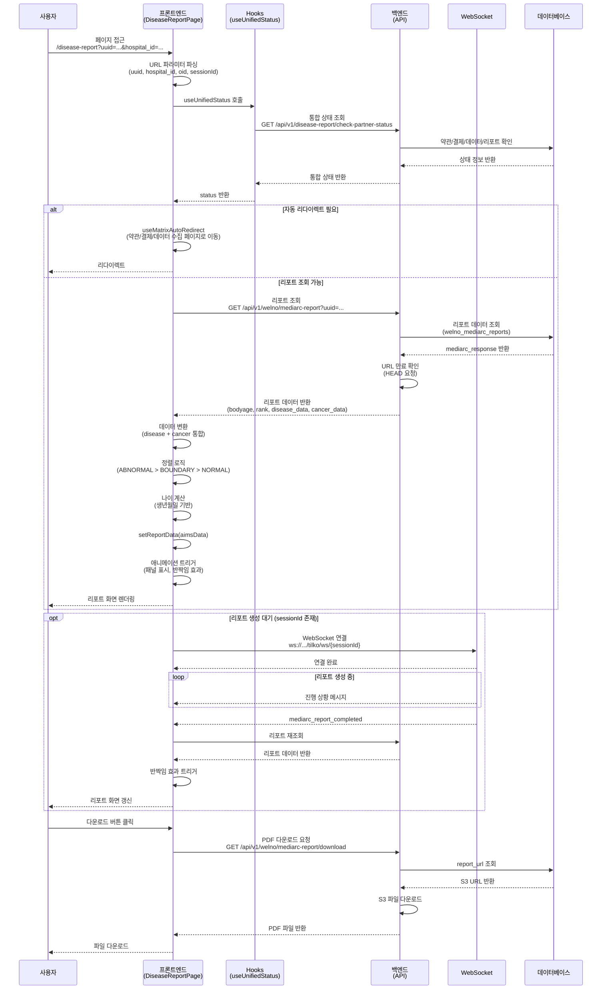

# 질병예측 리포트 화면 완전 가이드

**생성일**: 2026-01-31  
**작업일자**: 2026-01-31  
**작업내용**: 질병예측 리포트 화면 완전 가이드 (개발자·기획·QA)

> 작성자: AI Assistant  
> 대상: 개발자, 기획자, QA

## 📋 목차

1. [개요 및 진입점](#1-개요-및-진입점)
2. [컴포넌트 구조](#2-컴포넌트-구조)
3. [데이터 구조 및 API](#3-데이터-구조-및-api)
4. [리포트 섹션 상세](#4-리포트-섹션-상세)
5. [UI 컴포넌트 상세](#5-ui-컴포넌트-상세)
6. [상태 관리](#6-상태-관리)
7. [스타일링 및 테마](#7-스타일링-및-테마)
8. [데이터 흐름](#8-데이터-흐름)
9. [파일 구조 및 경로](#9-파일-구조-및-경로)
10. [코드 예시 및 구현](#10-코드-예시-및-구현)

---

## 1. 개요 및 진입점

### 1.1 리포트 화면 목적

질병예측 리포트 화면(`DiseaseReportPage`)은 사용자의 건강검진 데이터를 기반으로 생성된 질병/암 예측 리포트를 시각화하여 보여주는 페이지입니다.

**주요 기능:**
- 건강나이(bodyage) vs 검진나이 비교
- 동일 연령대 대비 건강 등수 표시
- 질병/암 발병 확률 시각화
- 질병/암 상세 정보 제공 (카드 슬라이더)
- PDF 다운로드 및 공유 기능

### 1.2 URL 패턴 및 파라미터

**기본 경로**: `/disease-report`

**URL 파라미터 (4가지 케이스):**

| 파라미터 | 타입 | 필수 | 설명 | 사용 케이스 |
|---------|------|------|------|------------|
| `uuid` | string | 선택 | 환자 UUID | WELNO 직접 접근 |
| `hospital_id` 또는 `hospital` | string | 선택 | 병원 ID | WELNO 직접 접근 |
| `oid` | string | 선택 | 파트너 결제 주문번호 | 파트너 캠페인 |
| `partner` | string | 선택 | 파트너 ID | 파트너 캠페인 |
| `sessionId` | string | 선택 | WebSocket 세션 ID | 실시간 생성 모니터링 |
| `generate` | string | 선택 | `'true'` 시 리포트 생성 | 생성 트리거 |

**URL 예시:**

```bash
# WELNO 직접 접근
/disease-report?uuid=abc123&hospital_id=PEERNINE

# 파트너 캠페인 (결제 완료)
/disease-report?oid=COCkkhabit_1737712345678&partner=kindhabit

# 리포트 생성 트리거
/disease-report?uuid=abc123&hospital_id=PEERNINE&generate=true&sessionId=session_123
```

### 1.3 라우팅 설정

**파일 위치**: `planning-platform/frontend/src/App.tsx` (524번째 줄)

```tsx
<Route path="/disease-report" element={<DiseaseReportPage />} />
```

### 1.4 진입 경로

1. **MainPage에서 리포트 버튼 클릭**
   - 환자 정보 확인 후 리포트 존재 시 자동 이동
   - URL: `/disease-report?uuid={uuid}&hospital_id={hospital_id}`

2. **캠페인 페이지에서 리포트 생성 완료 후**
   - 결제 완료 → 리포트 생성 완료 → 자동 리다이렉트
   - URL: `/disease-report?oid={oid}&partner={partner_id}`

3. **직접 URL 접근**
   - 북마크, 공유 링크 등
   - URL 파라미터로 환자 식별

---

## 2. 컴포넌트 구조

### 2.1 전체 계층 구조 (Mermaid 다이어그램)

```mermaid
graph TD
    A[DiseaseReportPage] --> B[Hooks]
    A --> C[Header]
    A --> D[Content]
    A --> E[Modals]
    
    B --> B1[useUnifiedStatus]
    B --> B2[useMatrixAutoRedirect]
    B --> B3[useFloatingButton]
    B --> B4[useWebSocketAuth]
    B --> B5[useCampaignSkin]
    
    C --> C1[뒤로가기 버튼]
    C --> C2[리포트 제목]
    C --> C3[색상 모드 토글]
    C --> C4[다운로드/공유 버튼]
    C --> C5[업데이트 시간]
    
    D --> D1[HealthAgeSection<br/>건강나이]
    D --> D2[RankSection<br/>등수]
    D --> D3[ProbabilitySection<br/>발병확률]
    D --> D4[DiseasesSection<br/>질병/암 리스트]
    
    D1 --> D1A[검진나이 박스]
    D1 --> D1B[화살표]
    D1 --> D1C[건강나이 박스]
    D1 --> D1D[비교 메시지]
    
    D2 --> D2A[내 건강나이 등수<br/>메인]
    D2 --> D2B[좋은 항목 2개<br/>🥇🥈]
    D2 --> D2C[구분선]
    D2 --> D2D[나쁜 항목 2개<br/>⚠️]
    
    D3 --> D3A[요약 메시지]
    D3 --> D3B[원형 차트 2x2<br/>상위 4개]
    
    D4 --> D4A[CancerSection<br/>암]
    D4 --> D4B[DiseaseSection<br/>질병]
    
    D4A --> D4A1[필터 버튼]
    D4A --> D4A2[슬라이더 카드]
    D4A --> D4A3[도트 인디케이터]
    
    D4B --> D4B1[필터 버튼]
    D4B --> D4B2[슬라이더 카드]
    D4B --> D4B3[도트 인디케이터]
    
    E --> E1[DebugDeleteModal]
    E --> E2[EmailInputModal]
```



### 2.2 컴포넌트 파일 구조

```
planning-platform/frontend/src/features/disease-report/
├── pages/
│   └── DiseaseReportPage.tsx           # 메인 컴포넌트 (2157줄)
│       └── hooks/
│           ├── useMatrixAutoRedirect.ts  # 자동 리다이렉트 로직
│           └── useFloatingButton.ts      # 플로팅 버튼 제어
│
├── hooks/
│   ├── useUnifiedStatus.ts             # 통합 상태 관리 (백엔드 기반)
│   ├── useCampaignSkin.ts              # 테마 관리 (기본/브라운)
│   └── useAIMSReportPolling.ts         # 리포트 생성 폴링
│
├── components/
│   ├── DebugDeleteModal.tsx            # 디버그 모드 삭제 모달
│   └── ReportActionModal.tsx           # 리포트 액션 모달
│
├── types/
│   ├── aimsReport.ts                   # 리포트 데이터 타입 정의
│   └── index.ts                        # 기타 타입 정의
│
├── styles/
│   ├── aims-report.scss                # 메인 리포트 스타일 (1662줄)
│   ├── campaign.scss                   # 캠페인 스타일
│   ├── campaign-fixed.scss             # 고정 요소 스타일
│   └── debug-delete-modal.scss         # 디버그 모달 스타일
│
└── utils/
    ├── ageCalculator.ts                # 나이 계산 유틸
    ├── gtm.ts                          # Google Tag Manager 추적
    └── legacyCompat.ts                 # 레거시 호환성 함수
```

### 2.3 주요 Hooks

| Hook | 파일 위치 | 용도 |
|------|----------|------|
| `useUnifiedStatus` | `hooks/useUnifiedStatus.ts` | 백엔드 기반 통합 상태 관리 (약관/결제/데이터/리포트) |
| `useMatrixAutoRedirect` | `pages/DiseaseReportPage/hooks/useMatrixAutoRedirect.ts` | 상태에 따른 자동 리다이렉트 (약관, 결제, 데이터 수집) |
| `useFloatingButton` | `pages/DiseaseReportPage/hooks/useFloatingButton.ts` | 플로팅 버튼 표시 제어 |
| `useWebSocketAuth` | `hooks/useWebSocketAuth.ts` | Tilko 인증 세션 WebSocket 연결 |
| `useCampaignSkin` | `hooks/useCampaignSkin.ts` | 스킨 모드 관리 (G: 기본, Br: 브라운) |

---

## 3. 데이터 구조 및 API

### 3.1 API 엔드포인트 (2가지)

#### 3.1.1 WELNO 케이스 (직접 접근)

**엔드포인트**: `GET /api/v1/welno/mediarc-report`

**요청 파라미터**:
```typescript
{
  uuid: string,        // 환자 UUID
  hospital_id: string  // 병원 ID
}
```

**응답 구조**:
```json
{
  "success": true,
  "has_report": true,
  "data": {
    "bodyage": 63,
    "rank": 51,
    "report_url": "https://kr.ncloudstorage.com/.../report.pdf",
    "disease_data": [...],
    "cancer_data": [...],
    "updated_at": "2026-01-31T12:34:56"
  }
}
```

#### 3.1.2 파트너 케이스 (캠페인)

**엔드포인트**: `GET /api/v1/campaigns/disease-prediction/report`

**요청 파라미터**:
```typescript
{
  oid: string  // 주문번호
}
```

**응답 구조**:
```json
{
  "success": true,
  "oid": "COCkkhabit_1737712345678",
  "status": "completed",
  "report_url": "https://kr.ncloudstorage.com/.../report.pdf",
  "error_message": null,
  "updated_at": "2026-01-31T12:34:56",
  "mediarc_response": {
    "bodyage": 63,
    "rank": 51,
    "disease_data": [...],
    "cancer_data": [...]
  },
  "user_name": "홍길동"
}
```

**에러 응답 (리포트 생성 실패)**:
```json
{
  "success": false,
  "oid": "COCkkhabit_1737712345678",
  "status": "REPORT_FAILED",
  "error_message": "리포트 생성 중 오류가 발생했습니다...",
  "updated_at": "2026-01-31T12:34:56",
  "user_name": "홍길동",
  "should_redirect_to_landing": true
}
```

### 3.2 mediarc_response 상세 구조

#### 3.2.1 전체 구조 표

| 필드 | 타입 | 필수 | 설명 | 예시 |
|------|------|------|------|------|
| `bodyage` | number | ✅ | 건강나이 (체질나이) | `63` |
| `rank` | number | ✅ | 동일 연령대 대비 등수 (100명 중) | `51` |
| `disease_data` | array | ✅ | 질병 예측 결과 배열 | `[...]` |
| `cancer_data` | array | ✅ | 암 예측 결과 배열 | `[...]` |
| `report_url` | string | 선택 | PDF 리포트 S3 URL | `https://...` |
| `provider` | string | 선택 | 제공자 | `"twobecon"` |
| `analyzed_at` | string | 선택 | 분석 완료 시각 (ISO 8601) | `"2026-01-23T12:34:56"` |

#### 3.2.2 disease_data 배열 구조

각 항목의 타입:
```typescript
interface AIMSDataItem {
  name: string;           // 질병명 (예: "고혈압")
  code: string;           // 질병 코드 (예: "hypertension")
  type: 'disease';        // 타입 (항상 "disease")
  label: 'NORMAL' | 'BOUNDARY' | 'ABNORMAL';  // 판정 레이블
  rank: number;           // 등수 (1~100)
  average: number;        // 평균 발병률 (%)
  rate: number;           // 예상 발병률 (%)
  influence: AIMSInfluence[] | null;  // 영향 요인
}

interface AIMSInfluence {
  name: string;   // 영향 요인명 (예: "수축기혈압")
  code: string;   // 영향 요인 코드 (예: "sbp")
  label: string;  // 영향 요인 레이블 (예: "경계")
}
```

**예시**:
```json
{
  "name": "고혈압",
  "code": "hypertension",
  "type": "disease",
  "label": "BOUNDARY",
  "rank": 81,
  "average": 33,
  "rate": 4.1,
  "influence": [
    {
      "name": "수축기혈압",
      "code": "sbp",
      "label": "경계"
    }
  ]
}
```

#### 3.2.3 cancer_data 배열 구조

구조는 `disease_data`와 동일하며, `type`만 `'cancer'`로 변경됩니다.

**예시**:
```json
{
  "name": "위암",
  "code": "stomach_cancer",
  "type": "cancer",
  "label": "NORMAL",
  "rank": 45,
  "average": 28,
  "rate": 2.3,
  "influence": null
}
```

### 3.3 프론트엔드 데이터 변환

#### 3.3.1 AIMSResponse 타입 (프론트엔드)

**파일 위치**: `planning-platform/frontend/src/features/disease-report/types/aimsReport.ts`

```typescript
export interface AIMSResponse {
  bodyage: number;
  rank: number;
  data: AIMSDataItem[];  // disease + cancer 통합 배열
}
```

#### 3.3.2 데이터 변환 로직

**파일 위치**: `DiseaseReportPage.tsx` (474-483줄, 559-567줄)

**파트너 케이스**:
```typescript
const medarcResponse = data.mediarc_response || {};
const diseaseData = medarcResponse.disease_data || [];
const cancerData = medarcResponse.cancer_data || [];
const combinedData = [...diseaseData, ...cancerData];

const aimsData: AIMSResponse = {
  bodyage: medarcResponse.bodyage || 0,
  rank: medarcResponse.rank || 0,
  data: combinedData  // disease와 cancer를 하나의 배열로 통합
};
```

**WELNO 케이스**:
```typescript
const diseaseData = data.data.disease_data || [];
const cancerData = data.data.cancer_data || [];
const combinedData = [...diseaseData, ...cancerData];

const aimsData: AIMSResponse = {
  bodyage: data.data.bodyage || 0,
  rank: data.data.rank || 0,
  data: combinedData
};
```

#### 3.3.3 정렬 로직

**파일 위치**: `DiseaseReportPage.tsx` (1367-1396줄)

**정렬 우선순위**:
1. 레이블 우선순위: `ABNORMAL` > `BOUNDARY` > `NORMAL`
2. 같은 레이블 내: `rank` 높은 순 (내림차순)

**암 데이터 필터링 및 정렬**:
```typescript
const filteredCancerData = reportData?.data
  ? [...reportData.data]
      .filter((item) => {
        if (item.type !== 'cancer') return false;
        if (cancerLabelFilter !== 'ALL' && normalizeLabel(item.label) !== cancerLabelFilter) return false;
        return true;
      })
      .sort((a, b) => {
        const labelOrder: Record<string, number> = { 'ABNORMAL': 3, 'BOUNDARY': 2, 'NORMAL': 1 };
        const orderDiff = (labelOrder[normalizeLabel(b.label)] || 0) - (labelOrder[normalizeLabel(a.label)] || 0);
        if (orderDiff !== 0) return orderDiff;
        return b.rank - a.rank;  // 같은 레이블이면 rank 높은 순
      })
  : [];
```

**질병 데이터 필터링 및 정렬**: 암 데이터와 동일한 로직

---

## 4. 리포트 섹션 상세

### 4.1 Header (헤더)

**파일 위치**: `DiseaseReportPage.tsx` (1548-1605줄)

**구성 요소**:

| 요소 | 설명 | 기능 |
|------|------|------|
| 뒤로가기 버튼 | `←` 아이콘 | `navigate(-1)` 이전 페이지로 이동 |
| 리포트 제목 | "질병예측 리포트" | 페이지 제목 표시 |
| 색상 모드 토글 | 기본/브라운 전환 버튼 | `changeSkin('G' | 'Br')` 스킨 변경 |
| 다운로드 버튼 (데스크톱) | "⬇️ 다운로드" | `handleDownload()` PDF 다운로드 |
| 공유 버튼 (모바일) | "📤 공유" | `handleShare()` Web Share API 또는 클립보드 |
| 업데이트 시간 | "업데이트: 2026-01-31..." | `reportUpdatedAt` 표시 |

**코드 예시**:
```tsx
<header className="report-header">
  <div className="report-header-top">
    <button className="back-button" onClick={() => navigate(-1)}>
      ← 뒤로
    </button>
    <h1 className="report-title">질병예측 리포트</h1>
    <div className="report-header-actions">
      <button className="skin-toggle-button" onClick={() => handleSkinChange(isBrownMode ? 'default' : 'brown')}>
        {isBrownMode ? '기본 모드' : '브라운 모드'}
      </button>
    </div>
  </div>
  <div className="report-header-bottom">
    {!isMobile ? (
      <button className="report-action-button download-button" onClick={handleDownload}>
        ⬇️ 다운로드
      </button>
    ) : (
      <button className="report-action-button share-button" onClick={handleShare}>
        📤 공유
      </button>
    )}
    {reportUpdatedAt && (
      <div className="report-update-time">
        업데이트: {reportUpdatedAt}
      </div>
    )}
  </div>
</header>
```

### 4.2 HealthAgeSection (건강나이 섹션)

**파일 위치**: 
- 컴포넌트: `components/health/HealthAgeSection/index.tsx`
- 사용: `DiseaseReportPage.tsx` (1631-1638줄)

**구성 요소**:

```
┌─────────────────────────────────────────┐
│  실제 나이보다 건강나이가 1.5세 높습니다   │  ← 비교 메시지
├─────────────────────────────────────────┤
│ ┌────────┐    →    ┌────────┐          │
│ │검진나이 │  화살표  │건강나이 │          │
│ │  61세  │    →    │ 62.5세 │          │  ← 나이 박스들
│ └────────┘         └────────┘          │
└─────────────────────────────────────────┘
```

**Props**:
```typescript
interface HealthAgeSectionProps {
  healthAge: number;           // 건강나이 (bodyage)
  actualAge: number | null;    // 검진나이 (실제나이)
  variant?: 'default' | 'card'; // 레이아웃 타입
  className?: string;
  showGlowEffect?: boolean;    // 반짝임 효과
  onAgeClick?: () => void;     // 클릭 핸들러 (디버그 모드)
  compact?: boolean;
  showBorder?: boolean;
}
```

**특수 기능**:
- **반짝임 효과**: `showGlowEffect={true}` 시 `glow-effect` 클래스 추가
- **디버그 모달**: 나이 박스 3회 연속 클릭 시 `DebugDeleteModal` 표시

**코드 예시** (사용):
```tsx
<HealthAgeSection
  healthAge={reportData.bodyage}
  actualAge={currentAge}
  variant="card"
  showGlowEffect={showAgeCardGlow}
  onAgeClick={handleAgeBoxClick}
/>
```

### 4.3 RankSection (등수 섹션)

**파일 위치**: `DiseaseReportPage.tsx` (1674-1750줄)

**구성 요소**:

```
┌─────────────────────────────────────────┐
│ 내 건강나이 등수                          │  ← 섹션 제목
├─────────────────────────────────────────┤
│ 😊  당신의 건강나이는 51등 입니다         │  ← 메인 등수
├─────────────────────────────────────────┤
│ 🥇  콜레스테롤       30등                │  ← 좋은 항목 1
│ 🥈  혈당            45등                │  ← 좋은 항목 2
├─────────────────────────────────────────┤  ← 구분선
│ ⚠️  혈압            65등                │  ← 나쁜 항목 1
│ ⚠️  간기능          72등                │  ← 나쁜 항목 2
└─────────────────────────────────────────┘
```

**로직**:

1. **메인 등수 이모지**:
   ```typescript
   const rankEmoji = reportData.rank <= 10 ? '😊' : reportData.rank <= 50 ? '😊' : '😢';
   ```

2. **좋은 항목 (상위 2개)**:
   - 조건: `item.rank < reportData.rank && item.rank <= 50`
   - 정렬: `rank` 낮은 순 (등수가 좋은 순)
   - 이모지: 1위 🥇, 2위 🥈

3. **나쁜 항목 (상위 2개)**:
   - 조건: `item.rank > reportData.rank`
   - 정렬: `rank` 낮은 순 (덜 나쁜 순)
   - 이모지: ⚠️

**코드 예시**:
```tsx
{/* 좋은 것 2개: 50등 이하가 있으면 보여주기 */}
{(() => {
  const goodItems = sortedData
    .filter(item => item.rank < reportData.rank && item.rank <= 50)
    .sort((a, b) => a.rank - b.rank)
    .slice(0, 2);

  if (goodItems.length > 0) {
    return goodItems.map((item, idx) => (
      <div key={item.code} className="rank-item rank-item-good">
        <div className="rank-icon">{idx === 0 ? '🥇' : '🥈'}</div>
        <div className="rank-info">
          <span className="rank-label">{item.name}</span>
          <span className="rank-value">{item.rank}등</span>
        </div>
      </div>
    ));
  }
})()}

{/* 나쁜 것 2개 */}
{sortedData
  .filter(item => item.rank > reportData.rank)
  .sort((a, b) => a.rank - b.rank)
  .slice(0, 2)
  .map((item, idx) => (
    <div key={item.code} className="rank-item rank-item-bad">
      <div className="rank-icon">⚠️</div>
      <div className="rank-info">
        <span className="rank-label">{item.name}</span>
        <span className="rank-value">{item.rank}등</span>
      </div>
    </div>
  ))}
```

### 4.4 ProbabilitySection (발병확률 섹션)

**파일 위치**: `DiseaseReportPage.tsx` (1752-1814줄)

**구성 요소**:

```
┌─────────────────────────────────────────┐
│ 주요질환 발병확률                          │  ← 섹션 제목
├─────────────────────────────────────────┤
│ 고객님은 최근 건강검진에서                 │
│ #고혈압 #당뇨병 #고지혈증 외 5건           │  ← 요약 메시지
│ 발병확률이 다른 확률보다 높게 나왔어요.      │
├─────────────────────────────────────────┤
│ ┌──────┐  ┌──────┐                     │
│ │ 4.1% │  │ 3.5% │                     │  ← 원형 차트 2x2
│ │ 경계  │  │ 위험  │                     │
│ │고혈압 │  │당뇨병 │                     │
│ └──────┘  └──────┘                     │
│ ┌──────┐  ┌──────┐                     │
│ │ 2.8% │  │ 2.1% │                     │
│ │ 정상  │  │ 정상  │                     │
│ │고지혈증│  │ 위암  │                     │
│ └──────┘  └──────┘                     │
└─────────────────────────────────────────┘
```

**요약 메시지 로직**:
```typescript
<span className="disease-tags">
  {sortedData.slice(0, 3).map((item, idx) => (
    <React.Fragment key={item.code}>
      <span className="disease-tag">#{item.name}</span>
      {idx < Math.min(2, sortedData.length - 1) && ' '}
    </React.Fragment>
  ))}
  {sortedData.length > 3 && (
    <span className="disease-count"> 외 {sortedData.length - 3}건</span>
  )}
</span>
```

**원형 차트 구현**:
```tsx
<div className="probability-charts-grid">
  {sortedData.slice(0, 4).map((item) => {
    const percentage = Math.min(item.rate, 100);
    return (
      <div key={item.code} className="probability-chart">
        <div className="chart-circle">
          <svg className="chart-svg" viewBox="0 0 100 100">
            <circle className="chart-background" cx="50" cy="50" r="45" />
            <circle
              className="chart-progress"
              cx="50"
              cy="50"
              r="45"
              strokeDasharray={`${2 * Math.PI * 45}`}
              strokeDashoffset={`${2 * Math.PI * 45 * (1 - percentage / 100)}`}
              style={{ stroke: getLabelColor(item.label) }}
            />
          </svg>
          <div className="chart-text">
            <span className="chart-percentage">{percentage}%</span>
            <span className="chart-label">{getLabelText(item.label)}</span>
          </div>
        </div>
        <p className="chart-disease-name">{item.name}</p>
      </div>
    );
  })}
</div>
```

**색상 매핑**:
```typescript
const getLabelColor = (label: string) => {
  switch (label) {
    case 'NORMAL':
    case '정상':
      return 'var(--success)';
    case 'BOUNDARY':
    case '경계':
    case '이상':
      return 'var(--warning)';
    case 'ABNORMAL':
    case '위험':
      return 'var(--danger)';
    default:
      return 'var(--text-secondary)';
  }
};
```

### 4.5 DiseasesSection (질병/암 리스트 섹션)

**파일 위치**: `DiseaseReportPage.tsx` (1816-2115줄)

#### 4.5.1 CancerSection (암 섹션)

**구성 요소**:

```
┌─────────────────────────────────────────┐
│ 암                                       │  ← 제목
│ [전체] [정상] [경계] [주의]                │  ← 필터 버튼
├─────────────────────────────────────────┤
│ ┌─────────────────────────────────────┐ │
│ │        위험 (우상단 뱃지)             │ │
│ │                                     │ │
│ │        위암                          │ │  ← 카드 1
│ │        암 / 위험도 순위: 72위         │ │
│ │        평균 발병률: 35% / 예상: 3.5% │ │
│ │        영향 요인: 가족력, ...         │ │
│ └─────────────────────────────────────┘ │
│            ● ○ ○ ○                      │  ← 도트 인디케이터
└─────────────────────────────────────────┘
```

**필터 로직**:
```typescript
const [cancerLabelFilter, setCancerLabelFilter] = useState<'ALL' | 'NORMAL' | 'BOUNDARY' | 'ABNORMAL'>('ALL');

<button
  className={`label-filter ${cancerLabelFilter === 'ALL' ? 'active' : ''}`}
  onClick={() => {
    setCancerLabelFilter('ALL');
    setCancerSliderIndex(0);
  }}
>
  전체
</button>
```

**슬라이더 카드**:
```tsx
<div className="diseases-slider-container" ref={cancerSliderContainerRef}>
  <div 
    className="diseases-slider"
    style={{
      transform: getSliderTransform(cancerSliderIndex, cancerSliderContainerRef)
    }}
    onTouchStart={handleCancerTouchStart}
    onTouchMove={handleCancerTouchMove}
    onTouchEnd={handleCancerTouchEnd}
    onMouseDown={handleCancerMouseDown}
    onMouseMove={handleCancerMouseMove}
    onMouseUp={handleCancerMouseUp}
    onMouseLeave={handleCancerMouseUp}
  >
    {filteredCancerData.map((item, idx) => (
      <div key={item.code} className={`disease-card ${isAbnormal(item.label) ? 'glow-effect' : ''}`}>
        <div className="disease-label-badge" style={{ backgroundColor: getLabelColor(item.label) }}>
          {getLabelText(item.label)}
        </div>
        <div className="disease-header">
          <h3 className="disease-name">{item.name}</h3>
          <div className="disease-meta">
            <span className="disease-type">{getTypeText(item.type)}</span>
            <span className="disease-rank">위험도 순위: {item.rank}위</span>
          </div>
        </div>
        <div className="disease-stats">
          <div className="disease-stat">
            <span className="stat-label">평균 발병률</span>
            <span className="stat-value">{item.average}%</span>
          </div>
          <div className="disease-stat">
            <span className="stat-label">예상 발병률</span>
            <span className="stat-value">{item.rate}%</span>
          </div>
        </div>
        {item.influence && item.influence.length > 0 && (
          <div className="disease-influence">
            <h4 className="influence-title">영향 요인</h4>
            <ul className="influence-list">
              {item.influence.map((inf, infIdx) => (
                <li key={infIdx} className="influence-item">
                  {inf.name} ({inf.label})
                </li>
              ))}
            </ul>
          </div>
        )}
      </div>
    ))}
  </div>
</div>
```

**도트 인디케이터**:
```tsx
{filteredCancerData.length > 1 && (
  <div className="diseases-slider-dots">
    {filteredCancerData.map((_, idx) => (
      <div
        key={idx}
        className={`slider-dot ${idx === cancerSliderIndex ? 'active' : ''}`}
        onClick={() => setCancerSliderIndex(idx)}
      />
    ))}
  </div>
)}
```

#### 4.5.2 DiseaseSection (질병 섹션)

구조와 로직은 CancerSection과 동일하며, 다음만 변경됩니다:
- 필터 상태: `diseaseLabelFilter`
- 슬라이더 인덱스: `diseaseSliderIndex`
- 데이터: `filteredDiseaseData`

---

## 5. UI 컴포넌트 상세

### 5.1 차트 (SVG 기반 커스텀)

#### 5.1.1 원형 프로그레스 차트

**파일 위치**: `DiseaseReportPage.tsx` (1776-1813줄)

**구현 원리**:
- SVG `<circle>` 요소 사용
- `stroke-dasharray`와 `stroke-dashoffset`으로 진행률 표현

**수식**:
```typescript
const circumference = 2 * Math.PI * radius;  // 원 둘레
const strokeDasharray = circumference;       // 전체 둘레
const strokeDashoffset = circumference * (1 - percentage / 100);  // 진행률에 따라 오프셋
```

**코드**:
```tsx
<svg className="chart-svg" viewBox="0 0 100 100">
  {/* 배경 원 */}
  <circle
    className="chart-background"
    cx="50"
    cy="50"
    r="45"
  />
  {/* 진행률 원 */}
  <circle
    className="chart-progress"
    cx="50"
    cy="50"
    r="45"
    strokeDasharray={`${2 * Math.PI * 45}`}
    strokeDashoffset={`${2 * Math.PI * 45 * (1 - percentage / 100)}`}
    style={{ stroke: getLabelColor(item.label) }}
  />
</svg>
```

**반응형 크기**:
```scss
.probability-chart {
  width: 140px;
  height: 140px;

  @media (max-width: 480px) {
    width: 120px;
    height: 120px;
  }
}
```

### 5.2 카드 컴포넌트

#### 5.2.1 질병/암 카드 구조

**레이아웃**:
```
┌─────────────────────────────┐
│ [위험] ←우상단 뱃지           │
├─────────────────────────────┤
│ 고혈압                       │  ← 질병명
│ 질병 / 위험도 순위: 81위      │  ← 메타 정보
├─────────────────────────────┤
│ 평균 발병률: 33%             │  ← 통계
│ 예상 발병률: 4.1%            │
├─────────────────────────────┤
│ 영향 요인:                   │  ← 영향 요인
│ • 수축기혈압 (경계)          │
│ • 이완기혈압 (정상)          │
└─────────────────────────────┘
```

**CSS 클래스**:
```scss
.disease-card {
  width: 100%;
  background: var(--report-panel-bg);
  border-radius: 16px;
  padding: 24px;
  box-shadow: 0 4px 12px rgba(0, 0, 0, 0.1);
  position: relative;

  &.glow-effect {
    animation: glow-pulse 2s ease-in-out infinite;
  }
}

.disease-label-badge {
  position: absolute;
  top: 16px;
  right: 16px;
  padding: 4px 12px;
  border-radius: 12px;
  color: white;
  font-size: 12px;
  font-weight: 600;
}
```

### 5.3 슬라이더 (스와이프 지원)

#### 5.3.1 터치/마우스 이벤트 처리

**상태 관리**:
```typescript
const [cancerSliderIndex, setCancerSliderIndex] = useState(0);
const [cancerTouchStartX, setCancerTouchStartX] = useState<number | null>(null);
const [cancerTouchEndX, setCancerTouchEndX] = useState<number | null>(null);
const cancerSliderContainerRef = useRef<HTMLDivElement>(null);
```

**터치 핸들러**:
```typescript
const handleCancerTouchStart = (e: React.TouchEvent) => {
  setCancerTouchStartX(e.targetTouches[0].clientX);
};

const handleCancerTouchMove = (e: React.TouchEvent) => {
  setCancerTouchEndX(e.targetTouches[0].clientX);
};

const handleCancerTouchEnd = () => {
  if (cancerTouchStartX === null || cancerTouchEndX === null) return;

  const diff = cancerTouchStartX - cancerTouchEndX;
  const threshold = 50; // 최소 스와이프 거리

  if (Math.abs(diff) > threshold) {
    if (diff > 0) {
      // 왼쪽 스와이프 (다음)
      setCancerSliderIndex((prev) => Math.min(prev + 1, filteredCancerData.length - 1));
    } else {
      // 오른쪽 스와이프 (이전)
      setCancerSliderIndex((prev) => Math.max(prev - 1, 0));
    }
  }

  setCancerTouchStartX(null);
  setCancerTouchEndX(null);
};
```

**마우스 핸들러** (데스크톱):
```typescript
const [cancerMouseStartX, setCancerMouseStartX] = useState<number | null>(null);
const [cancerMouseEndX, setCancerMouseEndX] = useState<number | null>(null);
const [cancerIsMouseDown, setCancerIsMouseDown] = useState(false);

const handleCancerMouseDown = (e: React.MouseEvent) => {
  setCancerIsMouseDown(true);
  setCancerMouseStartX(e.clientX);
};

const handleCancerMouseMove = (e: React.MouseEvent) => {
  if (!cancerIsMouseDown) return;
  setCancerMouseEndX(e.clientX);
};

const handleCancerMouseUp = () => {
  if (!cancerIsMouseDown) return;
  setCancerIsMouseDown(false);

  if (cancerMouseStartX === null || cancerMouseEndX === null) return;

  const diff = cancerMouseStartX - cancerMouseEndX;
  const threshold = 50;

  if (Math.abs(diff) > threshold) {
    if (diff > 0) {
      setCancerSliderIndex((prev) => Math.min(prev + 1, filteredCancerData.length - 1));
    } else {
      setCancerSliderIndex((prev) => Math.max(prev - 1, 0));
    }
  }

  setCancerMouseStartX(null);
  setCancerMouseEndX(null);
};
```

#### 5.3.2 Transform 계산

**함수**:
```typescript
const getSliderTransform = (index: number, containerRef: React.RefObject<HTMLDivElement>) => {
  if (!containerRef.current) return 'translateX(0)';
  const containerWidth = containerRef.current.offsetWidth;
  const cardWidth = containerWidth;
  const gap = 16; // 카드 간격
  const offset = -(index * (cardWidth + gap));
  return `translateX(${offset}px)`;
};
```

**적용**:
```tsx
<div 
  className="diseases-slider"
  style={{
    transform: getSliderTransform(cancerSliderIndex, cancerSliderContainerRef)
  }}
>
  {/* 카드들 */}
</div>
```

**CSS**:
```scss
.diseases-slider {
  display: flex;
  gap: 16px;
  transition: transform 0.3s ease-out;
}
```

### 5.4 인터랙션 요소

#### 5.4.1 PDF 다운로드

**파일 위치**: `DiseaseReportPage.tsx` (833-1065줄)

**백엔드 프록시 API**:
- WELNO: `GET /api/v1/welno/mediarc-report/download`
- 파트너: `GET /api/v1/campaigns/disease-prediction/report/download`

**구현**:
```typescript
const handleDownload = useCallback(async () => {
  if (!reportUrl) {
    alert('리포트 URL이 없습니다.');
    return;
  }

  try {
    console.log('📥 [다운로드] 백엔드 프록시 API로 다운로드 시도...');

    let downloadUrl = '';
    if (oid) {
      // 파트너 케이스
      downloadUrl = `/api/v1/campaigns/disease-prediction/report/download?oid=${oid}`;
    } else if (uuid && hospitalId) {
      // WELNO 케이스
      downloadUrl = `/api/v1/welno/mediarc-report/download?uuid=${uuid}&hospital_id=${hospitalId}`;
    } else {
      alert('환자 정보가 없습니다.');
      return;
    }

    // 링크 클릭 시뮬레이션으로 다운로드
    const link = document.createElement('a');
    link.href = downloadUrl;
    link.download = `질병예측_리포트_${customerName || uuid}.pdf`;
    document.body.appendChild(link);
    link.click();
    document.body.removeChild(link);

    console.log('✅ [다운로드] 다운로드 완료');
  } catch (err) {
    console.error('❌ [다운로드] 오류:', err);
    alert('다운로드 중 오류가 발생했습니다.');
  }
}, [reportUrl, oid, uuid, hospitalId, customerName]);
```

**백엔드 프록시** (파일: `campaign_payment.py` 1007-1086줄):
```python
@router.get("/disease-prediction/report/download")
async def download_campaign_report(oid: str = Query(...)):
    """파트너 리포트 PDF 다운로드 (프록시)"""
    try:
        # OID로 리포트 URL 조회
        with db_manager.get_connection() as conn:
            with conn.cursor() as cur:
                cur.execute("""
                    SELECT report_url, user_name
                    FROM welno.tb_campaign_payments
                    WHERE oid = %s
                """, (oid,))
                row = cur.fetchone()
                
        if not row or not row[0]:
            raise HTTPException(status_code=404, detail="리포트를 찾을 수 없습니다.")
        
        report_url = row[0]
        user_name = row[1] or "환자"
        
        # S3 URL에서 파일 다운로드
        async with httpx.AsyncClient() as client:
            response = await client.get(report_url)
            if response.status_code != 200:
                raise HTTPException(status_code=404, detail="리포트 파일을 가져올 수 없습니다.")
            
            # 한글 파일명 처리
            filename = f"질병예측_리포트_{user_name}.pdf"
            encoded_filename = quote(filename)
            
            return Response(
                content=response.content,
                media_type="application/pdf",
                headers={
                    "Content-Disposition": f"attachment; filename*=UTF-8''{encoded_filename}"
                }
            )
    except Exception as e:
        logger.error(f"download_campaign_report error: {e}")
        raise HTTPException(status_code=500, detail=str(e))
```

#### 5.4.2 공유 기능 (모바일)

**파일 위치**: `DiseaseReportPage.tsx` (1115-1266줄)

**구현**:
```typescript
const handleShare = useCallback(async () => {
  if (!reportUrl) {
    alert('리포트 URL이 없습니다.');
    return;
  }

  // 모바일: Web Share API 또는 URL 복사
  if (isMobile) {
    if (navigator.share) {
      try {
        await navigator.share({
          title: '질병예측 리포트',
          text: '질병예측 리포트를 공유합니다.',
          url: window.location.href,
        });
        console.log('✅ [공유] Web Share API로 공유 완료');
      } catch (err) {
        console.log('⚠️ [공유] Web Share API 취소 또는 오류:', err);
        // 폴백: 클립보드 복사
        await navigator.clipboard.writeText(window.location.href);
        alert('링크가 클립보드에 복사되었습니다!');
      }
    } else {
      // Web Share API 미지원: 클립보드 복사
      await navigator.clipboard.writeText(window.location.href);
      alert('링크가 클립보드에 복사되었습니다!');
    }
  } else {
    // 데스크톱: PDF를 새 창에서 열기
    window.open(reportUrl, '_blank');
  }
}, [reportUrl, isMobile]);
```

#### 5.4.3 이메일 전송

**파일 위치**: `DiseaseReportPage.tsx` (746-781줄)

**모달 표시**:
```typescript
// 커스텀 이벤트 리스너
useEffect(() => {
  const handleEmailModal = () => {
    setShowEmailModal(true);
  };
  
  window.addEventListener('welno-email-modal-open', handleEmailModal);
  
  return () => {
    window.removeEventListener('welno-email-modal-open', handleEmailModal);
  };
}, []);
```

**이메일 제출**:
```typescript
const handleEmailSubmit = async (email: string) => {
  try {
    const response = await fetch(API_ENDPOINTS.UPDATE_EMAIL, {
      method: 'POST',
      headers: { 'Content-Type': 'application/json' },
      body: JSON.stringify({
        email,
        oid: oid || undefined,
        uuid: uuid || undefined,
        hospital_id: hospitalId || undefined
      }),
    });
    
    const data = await response.json();
    
    if (data.success) {
      alert('이메일이 등록되었습니다. 리포트가 발송됩니다.');
      setShowEmailModal(false);
    } else {
      alert(data.message || '이메일 등록에 실패했습니다.');
    }
  } catch (err) {
    console.error('이메일 등록 오류:', err);
    alert('이메일 등록 중 오류가 발생했습니다.');
  }
};
```

---

## 6. 상태 관리

### 6.1 useState 상태 변수

**파일 위치**: `DiseaseReportPage.tsx` (92-115줄)

| 상태 변수 | 타입 | 초기값 | 용도 |
|----------|------|--------|------|
| `loading` | boolean | `true` | 리포트 조회 로딩 상태 |
| `error` | string \| null | `null` | 에러 메시지 |
| `reportData` | AIMSResponse \| null | `null` | 리포트 데이터 (bodyage, rank, data) |
| `reportUrl` | string \| null | `null` | 리포트 PDF URL |
| `customerName` | string \| null | `null` | 사용자 이름 |
| `customerBirthday` | string \| null | `null` | 사용자 생년월일 |
| `customerPhone` | string \| null | `null` | 사용자 전화번호 |
| `currentAge` | number \| null | `null` | 검진나이 (실제나이) |
| `ageComparison` | object \| null | `null` | 나이 비교 결과 (`ageDifference`, `isHealthier`) |
| `dataSource` | 'db' \| 'delayed' \| null | `null` | 데이터 출처 |
| `reportUpdatedAt` | string \| null | `null` | 리포트 업데이트 시간 |
| `showPanel` | boolean | `false` | 패널 표시 여부 (애니메이션) |
| `showAgeCardGlow` | boolean | `false` | 건강나이 카드 반짝임 효과 |
| `isBrownMode` | boolean | `skinType === 'Br'` | 브라운 모드 여부 |
| `cancerLabelFilter` | 'ALL' \| 'NORMAL' \| 'BOUNDARY' \| 'ABNORMAL' | `'ALL'` | 암 섹션 필터 |
| `diseaseLabelFilter` | 'ALL' \| 'NORMAL' \| 'BOUNDARY' \| 'ABNORMAL' | `'ALL'` | 질병 섹션 필터 |
| `cancerSliderIndex` | number | `0` | 암 섹션 슬라이더 인덱스 |
| `diseaseSliderIndex` | number | `0` | 질병 섹션 슬라이더 인덱스 |
| `ageBoxClickCount` | number | `0` | 나이 박스 클릭 횟수 (디버그 모드) |
| `showDebugModal` | boolean | `false` | 디버그 모달 표시 여부 |
| `showEmailModal` | boolean | `false` | 이메일 모달 표시 여부 |

### 6.2 타입 정의

**파일 위치**: `features/disease-report/types/aimsReport.ts`

```typescript
export interface AIMSInfluence {
  name: string;
  code: string;
  label: string;
}

export interface AIMSDataItem {
  name: string;
  code: string;
  type: 'disease' | 'cancer';
  label: 'NORMAL' | 'BOUNDARY' | 'ABNORMAL';
  rank: number;
  average: number;
  rate: number;
  influence: AIMSInfluence[] | null;
}

export interface AIMSResponse {
  bodyage: number;
  rank: number;
  data: AIMSDataItem[];
}
```

### 6.3 에러 처리

**4가지 에러 케이스**:

1. **리포트 없음**:
   ```typescript
   if (!data.has_report) {
     setError('질병예측 리포트가 없습니다. 리포트를 생성해주세요.');
     setLoading(false);
     return;
   }
   ```

2. **리포트 생성 실패** (파트너 케이스):
   ```typescript
   if (data.should_redirect_to_landing) {
     alert(data.error_message || '리포트 생성 중 오류가 발생했습니다.');
     const urlParams = new URLSearchParams(window.location.search);
     const redirectUrl = `/campaigns/disease-prediction/?${urlParams.toString()}`;
     window.location.href = redirectUrl;
     return;
   }
   ```

3. **네트워크 오류**:
   ```typescript
   catch (err) {
     console.error('[리포트 조회] 오류:', err);
     setError('리포트 조회 중 오류가 발생했습니다.');
     setLoading(false);
   }
   ```

4. **환자 정보 없음**:
   ```typescript
   if (!uuid || !hospitalId) {
     setError('환자 정보가 없습니다.');
     setLoading(false);
     return;
   }
   ```

### 6.4 WebSocket 연동

**파일 위치**: `DiseaseReportPage.tsx` (230-330줄)

**WebSocket 메시지 핸들러**:
```typescript
const { status: wsStatus, connect: wsConnect } = useWebSocketAuth({
  sessionId: sessionId || '',
  onMessage: (message) => {
    if (message.type === 'mediarc_report_completed') {
      console.log('✅ [WebSocket] Mediarc 리포트 생성 완료 알림 수신:', message);
      
      // 리포트 재조회
      fetchReport();
      
      // 반짝임 효과
      setShowAgeCardGlow(true);
    }
  }
});
```

**연결 트리거**:
```typescript
useEffect(() => {
  if (sessionId && shouldGenerate) {
    console.log('🔌 [WebSocket] 세션 연결 시도:', sessionId);
    wsConnect();
  }
}, [sessionId, shouldGenerate, wsConnect]);
```

---

## 7. 스타일링 및 테마

### 7.1 CSS 파일 위치

| 파일 | 경로 | 라인 수 | 용도 |
|------|------|---------|------|
| `aims-report.scss` | `features/disease-report/styles/` | 1662줄 | 메인 리포트 스타일 |
| `campaign.scss` | `features/disease-report/styles/` | - | 캠페인 스타일 |
| `campaign-fixed.scss` | `features/disease-report/styles/` | - | 고정 요소 스타일 (플로팅 버튼 등) |
| `debug-delete-modal.scss` | `features/disease-report/styles/` | - | 디버그 모달 스타일 |

### 7.2 테마 설정

**Hook**: `useCampaignSkin`

**파일 위치**: `hooks/useCampaignSkin.ts`

**스킨 타입**:
- `'G'`: 기본 모드 (다크 테마)
- `'Br'`: 브라운 모드 (라이트 테마)

**사용 예시**:
```typescript
const { skinType, skinConfig, changeSkin } = useCampaignSkin();

// 스킨 변경
const handleSkinChange = (newMode: 'default' | 'brown') => {
  const newSkinType = newMode === 'brown' ? 'Br' : 'G';
  changeSkin(newSkinType);
};
```

### 7.3 CSS 변수

**파일 위치**: `aims-report.scss`

```scss
.aims-report-page {
  --report-page-bg: #f5f5f5;
  --report-panel-bg: #ffffff;
  --report-text-primary: #333333;
  --report-text-secondary: #666666;
  --report-accent-color: #4caf50;
  --report-chart-background: #e0e0e0;
  
  // 상태 색상
  --success: #4caf50;  // 정상 (녹색)
  --warning: #ff9800;  // 경계 (노란색)
  --danger: #f44336;   // 위험 (빨간색)
  
  &.skin-Br {
    --report-page-bg: #faf8f5;
    --report-panel-bg: #ffffff;
    --report-accent-color: #8b7355;
  }
}
```

### 7.4 반응형 디자인

**브레이크포인트**:
```scss
// 모바일
@media (max-width: 480px) {
  .probability-chart {
    width: 120px;
    height: 120px;
  }
  
  .probability-charts-grid {
    gap: 16px;
  }
}

// 태블릿
@media (max-width: 768px) {
  .report-header {
    padding: 12px 16px;
  }
  
  .report-content {
    padding: 16px;
  }
}
```

### 7.5 애니메이션

#### 7.5.1 페이드인 (패널 표시)

```scss
@keyframes fadeInUp {
  from {
    opacity: 0;
    transform: translateY(20px);
  }
  to {
    opacity: 1;
    transform: translateY(0);
  }
}

.report-panel.show {
  animation: fadeInUp 0.8s ease-out;
}
```

#### 7.5.2 반짝임 효과 (건강나이 카드)

```scss
@keyframes glow-pulse {
  0%, 100% {
    box-shadow: 0 0 5px rgba(76, 175, 80, 0.5);
  }
  50% {
    box-shadow: 0 0 20px rgba(76, 175, 80, 0.8);
  }
}

.glow-effect {
  animation: glow-pulse 2s ease-in-out infinite;
}
```

#### 7.5.3 슬라이드업

```scss
.report-content {
  transition: transform 0.3s ease-out;
  
  &.slide-up {
    transform: translateY(-20px);
  }
}
```

---

## 8. 데이터 흐름

### 8.1 전체 흐름 다이어그램 (Mermaid)



### 8.2 단계별 설명

#### 단계 1: 페이지 진입 및 URL 파싱

**파일 위치**: `DiseaseReportPage.tsx` (68-74줄)

```typescript
const uuid = searchParams.get('uuid') || StorageManager.getItem(STORAGE_KEYS.PATIENT_UUID) || '';
const hospitalId = searchParams.get('hospital_id') || searchParams.get('hospital') || StorageManager.getItem(STORAGE_KEYS.HOSPITAL_ID) || '';
const sessionId = searchParams.get('sessionId') || null;
const shouldGenerate = searchParams.get('generate') === 'true';
const oid = searchParams.get('oid') || null;
const partnerId = searchParams.get('partner') || null;
```

#### 단계 2: 통합 상태 확인

**파일 위치**: `DiseaseReportPage.tsx` (79-84줄)

```typescript
const { status: unifiedStatus, loading: statusLoading, error: statusError } = useUnifiedStatus(
  uuid, 
  hospitalId, 
  partnerId
);
```

**useUnifiedStatus Hook**:
- 백엔드 API 호출: `POST /api/v1/disease-report/check-partner-status`
- 반환 값: `{ status, loading, error }`
- 상태 타입: `TERMS_REQUIRED`, `PAYMENT_REQUIRED`, `REPORT_READY`, `REPORT_PENDING` 등

#### 단계 3: 자동 리다이렉트 (필요 시)

**파일 위치**: `DiseaseReportPage.tsx` (86-90줄)

```typescript
useMatrixAutoRedirect(unifiedStatus, uuid, partnerId);
useFloatingButton(unifiedStatus, uuid, partnerId);
```

**리다이렉트 조건**:
- `TERMS_REQUIRED` → 약관 동의 페이지
- `PAYMENT_REQUIRED` → 결제 페이지
- `DATA_REQUIRED` → 데이터 수집 페이지 (Tilko)

#### 단계 4: 리포트 API 조회

**파일 위치**: `DiseaseReportPage.tsx` (456-567줄)

**2가지 케이스**:

1. **파트너 케이스** (oid 존재):
   ```typescript
   const response = await fetch(`/api/v1/campaigns/disease-prediction/report?oid=${oid}`);
   ```

2. **WELNO 케이스** (uuid + hospital_id):
   ```typescript
   const response = await fetch(`/api/v1/welno/mediarc-report?uuid=${uuid}&hospital_id=${hospitalId}`);
   ```

#### 단계 5: 데이터 변환 및 정렬

**파일 위치**: `DiseaseReportPage.tsx` (474-493줄, 559-577줄)

```typescript
// disease_data + cancer_data 통합
const diseaseData = medarcResponse.disease_data || [];
const cancerData = medarcResponse.cancer_data || [];
const combinedData = [...diseaseData, ...cancerData];

const aimsData: AIMSResponse = {
  bodyage: medarcResponse.bodyage || 0,
  rank: medarcResponse.rank || 0,
  data: combinedData
};

setReportData(aimsData);
```

#### 단계 6: 렌더링 및 애니메이션

**파일 위치**: `DiseaseReportPage.tsx` (440-452줄)

```typescript
// 패널을 뿌연 상태로 올라오게 함
setTimeout(() => {
  setShowPanel(true);
  // 패널이 올라온 후 스피너를 더 보여주고, 그 다음 뿌연 상태 제거 및 반짝임 효과
  setTimeout(() => {
    setShowAgeCardGlow(true); // 반짝임 효과 트리거
  }, 1200);
}, 800);
```

#### 단계 7: WebSocket 연동 (실시간 생성 모니터링)

**파일 위치**: `DiseaseReportPage.tsx` (230-330줄)

```typescript
const { status: wsStatus, connect: wsConnect } = useWebSocketAuth({
  sessionId: sessionId || '',
  onMessage: (message) => {
    if (message.type === 'mediarc_report_completed') {
      console.log('✅ [WebSocket] Mediarc 리포트 생성 완료 알림 수신');
      fetchReport(); // 리포트 재조회
      setShowAgeCardGlow(true); // 반짝임 효과
    }
  }
});
```

---

## 9. 파일 구조 및 경로

### 9.1 주요 파일 경로 표

| 분류 | 파일명 | 경로 | 라인 수 | 설명 |
|------|--------|------|---------|------|
| **메인 컴포넌트** | `DiseaseReportPage.tsx` | `features/disease-report/pages/` | 2157 | 리포트 화면 메인 컴포넌트 |
| **타입 정의** | `aimsReport.ts` | `features/disease-report/types/` | 45 | 리포트 데이터 타입 정의 |
| **건강나이 컴포넌트** | `HealthAgeSection/index.tsx` | `components/health/HealthAgeSection/` | 101 | 건강나이 비교 섹션 |
| **Hooks** | `useUnifiedStatus.ts` | `features/disease-report/hooks/` | - | 통합 상태 관리 |
| | `useMatrixAutoRedirect.ts` | `features/disease-report/pages/DiseaseReportPage/hooks/` | - | 자동 리다이렉트 로직 |
| | `useFloatingButton.ts` | `features/disease-report/pages/DiseaseReportPage/hooks/` | - | 플로팅 버튼 제어 |
| | `useCampaignSkin.ts` | `features/disease-report/hooks/` | - | 스킨 모드 관리 |
| | `useWebSocketAuth.ts` | `hooks/` | - | WebSocket 연결 |
| **스타일** | `aims-report.scss` | `features/disease-report/styles/` | 1662 | 메인 리포트 스타일 |
| | `campaign.scss` | `features/disease-report/styles/` | - | 캠페인 스타일 |
| | `campaign-fixed.scss` | `features/disease-report/styles/` | - | 고정 요소 스타일 |
| **유틸리티** | `ageCalculator.ts` | `features/disease-report/utils/` | - | 나이 계산 함수 |
| | `gtm.ts` | `features/disease-report/utils/` | - | GTM 추적 함수 |
| | `legacyCompat.ts` | `features/disease-report/utils/` | - | 레거시 호환성 함수 |
| **백엔드 API** | `campaign_payment.py` | `backend/app/api/v1/endpoints/` | 1322 | 파트너 리포트 API |
| | `welno_data.py` | `backend/app/api/v1/endpoints/` | 2118 | WELNO 리포트 API |
| | `report_service.py` | `backend/app/services/mediarc/` | 288 | Mediarc 리포트 서비스 |

### 9.2 디렉토리 구조

```
planning-platform/
├── frontend/src/
│   ├── features/disease-report/
│   │   ├── pages/
│   │   │   └── DiseaseReportPage.tsx
│   │   │       └── hooks/
│   │   │           ├── useMatrixAutoRedirect.ts
│   │   │           └── useFloatingButton.ts
│   │   ├── hooks/
│   │   │   ├── useUnifiedStatus.ts
│   │   │   ├── useCampaignSkin.ts
│   │   │   └── useAIMSReportPolling.ts
│   │   ├── components/
│   │   │   ├── DebugDeleteModal.tsx
│   │   │   └── ReportActionModal.tsx
│   │   ├── types/
│   │   │   ├── aimsReport.ts
│   │   │   └── index.ts
│   │   ├── styles/
│   │   │   ├── aims-report.scss
│   │   │   ├── campaign.scss
│   │   │   └── campaign-fixed.scss
│   │   └── utils/
│   │       ├── ageCalculator.ts
│   │       ├── gtm.ts
│   │       └── legacyCompat.ts
│   ├── components/health/
│   │   └── HealthAgeSection/
│   │       ├── index.tsx
│   │       ├── styles.scss
│   │       └── types.ts
│   └── hooks/
│       └── useWebSocketAuth.ts
│
└── backend/app/
    ├── api/v1/endpoints/
    │   ├── campaign_payment.py
    │   └── welno_data.py
    └── services/mediarc/
        └── report_service.py
```

---

## 10. 코드 예시 및 구현

### 10.1 API 호출 코드

#### 10.1.1 리포트 조회 (WELNO 케이스)

```typescript
const fetchReport = useCallback(async () => {
  if (!uuid || !hospitalId) {
    setError('환자 정보가 없습니다.');
    setLoading(false);
    return;
  }

  try {
    console.log(`[리포트 조회] WELNO 케이스 - uuid: ${uuid}, hospital: ${hospitalId}`);
    
    const response = await fetch(`/api/v1/welno/mediarc-report?uuid=${uuid}&hospital_id=${hospitalId}`);
    const data = await response.json();
    
    if (data.success && data.has_report && data.data) {
      // 리포트 URL 저장
      if (data.data.report_url) {
        setReportUrl(data.data.report_url);
      }
      
      // 데이터 변환
      const diseaseData = data.data.disease_data || [];
      const cancerData = data.data.cancer_data || [];
      const combinedData = [...diseaseData, ...cancerData];
      
      const aimsData: AIMSResponse = {
        bodyage: data.data.bodyage || 0,
        rank: data.data.rank || 0,
        data: combinedData
      };
      
      setReportDataWithInfo(
        aimsData,
        'db',
        {
          name: data.data.customer_info?.name,
          birthday: data.data.customer_info?.birthday
        }
      );
      setLoading(false);
    } else {
      setError('리포트를 찾을 수 없습니다.');
      setLoading(false);
    }
  } catch (err) {
    console.error('[리포트 조회] 오류:', err);
    setError('리포트 조회 중 오류가 발생했습니다.');
    setLoading(false);
  }
}, [uuid, hospitalId]);
```

#### 10.1.2 리포트 조회 (파트너 케이스)

```typescript
if (oid) {
  try {
    console.log(`[리포트 조회] 파트너 케이스 - oid: ${oid}`);
    
    const response = await fetch(`/api/v1/campaigns/disease-prediction/report?oid=${oid}`);
    const data = await response.json();
    
    if (data.success && data.report_url) {
      setReportUrl(data.report_url);
      
      const medarcResponse = data.mediarc_response || {};
      const diseaseData = medarcResponse.disease_data || [];
      const cancerData = medarcResponse.cancer_data || [];
      const combinedData = [...diseaseData, ...cancerData];
      
      const aimsData: AIMSResponse = {
        bodyage: medarcResponse.bodyage || 0,
        rank: medarcResponse.rank || 0,
        data: combinedData
      };
      
      setReportDataWithInfo(
        aimsData,
        'db',
        {
          name: data.user_name,
          birthday: ''
        }
      );
      setLoading(false);
    } else if (data.should_redirect_to_landing) {
      // 리포트 생성 실패 - 랜딩 페이지로 리다이렉트
      alert(data.error_message || '리포트 생성 중 오류가 발생했습니다.');
      const urlParams = new URLSearchParams(window.location.search);
      const redirectUrl = `/campaigns/disease-prediction/?${urlParams.toString()}`;
      window.location.href = redirectUrl;
    } else {
      setError('리포트를 찾을 수 없습니다.');
      setLoading(false);
    }
  } catch (err) {
    console.error('[리포트 조회] 파트너 오류:', err);
    setError('리포트 조회 중 오류가 발생했습니다.');
    setLoading(false);
  }
}
```

### 10.2 데이터 변환 코드

#### 10.2.1 필터링 로직

```typescript
// 레이블 정규화 함수 (한글/영어 통합)
const normalizeLabel = (label: string): 'NORMAL' | 'BOUNDARY' | 'ABNORMAL' | string => {
  const labelMap: Record<string, string> = {
    '정상': 'NORMAL',
    'NORMAL': 'NORMAL',
    '경계': 'BOUNDARY',
    'BOUNDARY': 'BOUNDARY',
    '이상': 'BOUNDARY',
    '위험': 'ABNORMAL',
    'ABNORMAL': 'ABNORMAL'
  };
  return labelMap[label] || label;
};

// 암 데이터 필터링
const filteredCancerData = reportData?.data
  ? [...reportData.data]
      .filter((item) => {
        if (item.type !== 'cancer') return false;
        if (cancerLabelFilter !== 'ALL' && normalizeLabel(item.label) !== cancerLabelFilter) return false;
        return true;
      })
  : [];
```

#### 10.2.2 정렬 로직

```typescript
const sortedData = reportData?.data
  ? [...reportData.data].sort((a, b) => {
      // ABNORMAL > BOUNDARY > NORMAL 순서
      const labelOrder: Record<string, number> = { 'ABNORMAL': 3, 'BOUNDARY': 2, 'NORMAL': 1 };
      const orderDiff = (labelOrder[normalizeLabel(b.label)] || 0) - (labelOrder[normalizeLabel(a.label)] || 0);
      if (orderDiff !== 0) return orderDiff;
      
      // 같은 레이블이면 rank 높은 순
      return b.rank - a.rank;
    })
  : [];
```

### 10.3 차트 렌더링 코드

```tsx
<div className="probability-charts-grid">
  {sortedData.slice(0, 4).map((item) => {
    const percentage = Math.min(item.rate, 100);
    const circumference = 2 * Math.PI * 45;
    const strokeDashoffset = circumference * (1 - percentage / 100);
    
    return (
      <div key={item.code} className="probability-chart">
        <div className="chart-circle">
          <svg className="chart-svg" viewBox="0 0 100 100">
            <circle
              className="chart-background"
              cx="50"
              cy="50"
              r="45"
            />
            <circle
              className="chart-progress"
              cx="50"
              cy="50"
              r="45"
              strokeDasharray={circumference}
              strokeDashoffset={strokeDashoffset}
              style={{ stroke: getLabelColor(item.label) }}
            />
          </svg>
          <div className="chart-text">
            <span className="chart-percentage">{percentage}%</span>
            <span className="chart-label">{getLabelText(item.label)}</span>
          </div>
        </div>
        <p className="chart-disease-name">{item.name}</p>
      </div>
    );
  })}
</div>
```

### 10.4 슬라이더 구현 코드

```typescript
// Transform 계산
const getSliderTransform = (index: number, containerRef: React.RefObject<HTMLDivElement>) => {
  if (!containerRef.current) return 'translateX(0)';
  const containerWidth = containerRef.current.offsetWidth;
  const cardWidth = containerWidth;
  const gap = 16;
  const offset = -(index * (cardWidth + gap));
  return `translateX(${offset}px)`;
};

// 터치 핸들러
const handleCancerTouchStart = (e: React.TouchEvent) => {
  setCancerTouchStartX(e.targetTouches[0].clientX);
};

const handleCancerTouchMove = (e: React.TouchEvent) => {
  setCancerTouchEndX(e.targetTouches[0].clientX);
};

const handleCancerTouchEnd = () => {
  if (cancerTouchStartX === null || cancerTouchEndX === null) return;

  const diff = cancerTouchStartX - cancerTouchEndX;
  const threshold = 50;

  if (Math.abs(diff) > threshold) {
    if (diff > 0) {
      // 왼쪽 스와이프 (다음)
      setCancerSliderIndex((prev) => Math.min(prev + 1, filteredCancerData.length - 1));
    } else {
      // 오른쪽 스와이프 (이전)
      setCancerSliderIndex((prev) => Math.max(prev - 1, 0));
    }
  }

  setCancerTouchStartX(null);
  setCancerTouchEndX(null);
};
```

### 10.5 나이 계산 코드

```typescript
const calculateCurrentAge = (birthday: string): number => {
  const today = new Date();
  const birthDate = new Date(birthday);
  
  let age = today.getFullYear() - birthDate.getFullYear();
  const monthDiff = today.getMonth() - birthDate.getMonth();
  
  if (monthDiff < 0 || (monthDiff === 0 && today.getDate() < birthDate.getDate())) {
    age--;
  }
  
  return age;
};

// 나이 추정 (생년월일 없을 때)
if (age === null && data) {
  age = Math.round(data.bodyage + 2);
  console.log(`생년월일 없음: 건강나이(${data.bodyage}세) 기준으로 ${age}세 추정`);
}
```

---

## 📌 핵심 포인트 요약

### 1. 데이터 흐름
- **WELNO 케이스**: `uuid` + `hospital_id` → `welno_mediarc_reports` 테이블 조회
- **파트너 케이스**: `oid` → `tb_campaign_payments` 테이블 조회
- **데이터 통합**: `disease_data` + `cancer_data` → 단일 배열로 통합
- **정렬**: `ABNORMAL` > `BOUNDARY` > `NORMAL`, `rank` 높은 순

### 2. 주요 기능
- **건강나이 비교**: 검진나이 vs 건강나이 시각화
- **등수 표시**: 좋은 항목 2개 (🥇🥈), 나쁜 항목 2개 (⚠️)
- **발병확률 차트**: 원형 프로그레스 차트 (2x2 그리드)
- **질병/암 카드**: 슬라이더 형태 (스와이프 지원)
- **PDF 다운로드**: 백엔드 프록시 API 사용 (한글 파일명 지원)

### 3. 성능 최적화
- **WebSocket 연동**: 실시간 리포트 생성 모니터링
- **애니메이션**: 패널 표시, 반짝임 효과 (CSS 애니메이션)
- **반응형 디자인**: 모바일/태블릿/데스크톱 대응
- **URL 만료 처리**: 자동 재확인 및 대체 URL 사용

### 4. 에러 처리
- 리포트 없음 → 에러 메시지 표시
- 리포트 생성 실패 → 랜딩 페이지 리다이렉트
- 네트워크 오류 → 재시도 안내
- 환자 정보 없음 → 에러 메시지 표시

---

## 📞 문의 및 추가 정보

이 문서는 질병예측 리포트 화면의 현재 구조를 면밀하게 분석한 결과입니다.

**추가 문서**:
- 질병예측 캠페인 전체 플로우: `/docs/질병예측_캠페인_전체_플로우_및_시스템_개요.md` (예정)
- API 및 데이터 매핑 상세: `/docs/질병예측_캠페인_API_및_데이터_매핑_상세.md` (예정)

**관련 파일**:
- 프론트엔드: `planning-platform/frontend/src/features/disease-report/`
- 백엔드: `planning-platform/backend/app/api/v1/endpoints/campaign_payment.py`
- 백엔드: `planning-platform/backend/app/services/mediarc/report_service.py`

---

**문서 버전**: 1.0  
**생성일**: 2026-01-31  
**최종 수정**: 2026-01-31
