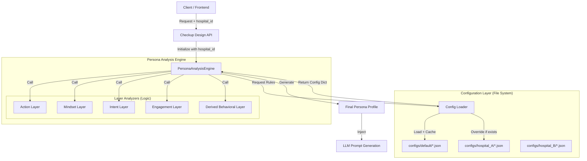

# 3D Persona Analysis & Dual-Profile System (20251208 Advanced Spec)

## 1. 개요 (Overview)
기존 1차원 점수제(1D Scoring) 페르소나 모델의 한계를 극복하기 위해, **Fact(환경/유전)**, **Mindset(심리/태도)**, **Action(행동/습관)**의 3가지 레이어로 데이터를 입체 분석합니다. 또한 환자의 성향(Persona)과 신체 상태(Clinical Body)를 분리하는 **Dual-Profile System**을 도입하여, 두 축이 교차하는 지점에서 최적의 설득 전략(Interaction Matrix)을 도출합니다.

---

## 2. 시스템 아키텍처 (Config-Driven Scoring Engine Architecture)

본 시스템은 2025년 리팩터링을 통해 **Config-Driven Scoring Engine** 아키텍처로 고도화되었습니다. 병원별, 검진센터별로 로직 변경 없이 설정 파일(`JSON`)만으로 스코어링 규칙과 가중치를 커스터마이징할 수 있습니다.

### 2.1 Architecture Diagram

### 2.2 Core Components

1.  **Config Loader (`config_loader.py`)**
    *   `hospital_id`를 기반으로 설정 파일을 로드합니다.
    *   해당 병원의 설정 파일이 없으면 `default` 설정을 자동으로 Fallback 로드합니다.
    *   메모리 캐싱(Caching)을 통해 성능 저하를 방지합니다.

2.  **Layered Engine (`persona_engine.py`)**
    *   기존의 단일 함수 로직을 5개의 독립된 Analyzer Class로 분리했습니다.
    *   **Action / Mindset / Intent / Engagement / Derived**
    *   각 Analyzer는 Config Loader로부터 주입받은 규칙(JSON)에 따라 점수를 계산합니다.

3.  **Configuration Files (`configs/`)**
    *   **`persona_weights.json`**: 5대 페르소나(Worrier, Manager 등)의 점수 산출 가중치
    *   **`behavior_rules.json`**: 문진 응답값(Key-Value)과 페르소나 점수 간의 매핑 규칙
    *   **`derived_layers.json`**: 4대 파생 레이어(Role, Investment, Goal, Stability)의 산출 공식 및 등급(Threshold)

---

## 3. 문진 및 의도 분석 설계 (Survey & Intent Spec)

### 3.1 문진 항목 매핑 (Survey Panel Options)
*이 매핑 규칙은 `configs/default/behavior_rules.json`에 정의되어 있으며, 병원별로 조정 가능합니다.*

#### [STEP 1] 내 몸의 신호 (Body Signals)
**Q1. 최근 6개월 내 체중 변화가 있으신가요?** (`weight_change`)
- "네, 관리해서 잘 유지/감량하고 있어요" (`good_management`) → **Optimizer +40**
- "변화 없어요 (특별한 노력 안함)" (`maintain_nature`) → (Neutral)
- "네, 의도치 않게 살이 쪘어요" (`increase_bad`) → **Manager +30**
- "네, 의도치 않게 살이 빠졌어요" (`decrease_bad`) → **Symptom Solver +20** (Red Flag)

#### [STEP 2] 일상 환경 (Environment)
**Q2. 평소 어떤 환경에서 일하시나요?** (`daily_routine`)
- "주로 앉아서 집중하는 사무직" (`sedentary`) → (Fact: 운동부족)
- "정신적 스트레스가 심한 관리/임원직" (`high_stress`) → **Manager +20**, **Symptom +10**
- "사람 상대가 많은 감정 노동" (`high_stress`) → **Symptom +10**
- "몸을 많이 쓰는 육체 노동" (`heavy_physical`) → (Fact: 육체피로)
- "규칙적인 생활 (주부/은퇴 등)" (`routine_work`) → (Neutral)

#### [STEP 3] 건강 습관 (Habits)
**Q3. 운동은 얼마나 자주 하시나요?** (`exercise_frequency`)
- "주 3회 이상 꾸준히" (`regular`) → **Optimizer +60**
- "생각날 때 가끔" (`sometimes`) → **Optimizer +20**
- "거의 안 함 (숨쉬기 운동만)" (`never`) → **Manager +20**

**Q4. 흡연을 하시나요?** (`smoking`)
- "현재 피웁니다" (`current_smoker`) → **Manager +60**
- "끊었습니다 (과거 흡연)" (`ex_smoker`) → **Optimizer +20**
- "비흡연" (`non_smoker`) → (Neutral)

**Q5. 음주는 얼마나 자주 하시나요?** (`drinking`)
- "주 3회 이상" (`weekly_3plus`) → **Manager +50**
- "주 1~2회" (`weekly_1_2`) → **Manager +20**
- "월 1~2회 미만" (`monthly_less`) → (Neutral)
- "전혀 안 함" (`never`) → (Neutral)

**Q6. 평소 수면은 어떠신가요?** (`sleep_hours`)
- "개운하게 잘 잡니다 (6~7시간 이상)" (`morning_refresh`) → **Optimizer +20**
- "밤늦게 자는게 편해요 (올빼미형)" (`night_owl_choice`) → **Minimalist +10**
- "잠들기 힘들거나 자주 깹니다" (`insomnia_stress`) → **Symptom Solver +30**
- "일 때문에 강제로 못 잡니다" (`forced_lack`) → **Manager +30**

#### [STEP 4] 가족력 및 예방 (Prevention)
**Q9. 대장내시경 검사를 받아보셨나요?** (`colonoscopy_experience`) (35세 이상만)
- "네, 주기적으로 받고 있습니다" (`confident_check`) → **Optimizer +30**
- "불편했지만 받긴 했습니다" (`symptom_driven`) → **Symptom Solver +20**
- "아뇨, 무섭고 힘들어서 미루고 있어요" (`avoid_fear`) → **Worrier +60** (Critical)
- "아뇨, 딱히 필요성을 못 느꼈어요" (`never_thought`) → **Minimalist +20**

**Q10. 검진에서 특별히 걱정되거나 확인하고 싶은 부분이 있나요?** (`additional_concerns`)
- (주관식 입력) 키워드 분석 수행

### 3.2 Chat Intent Analysis (채팅 의도 분석)
사용자가 채팅창에서 선택한 관심사(Concern) 키워드를 분석합니다. (`configs/default/persona_weights.json` 참조)

| 분류 | 키워드 (Keywords) | 점수 (Score) |
| :-- | :-- | :-- |
| **Worrier** | 암, 종양, 유전자, 마커, 가족력, 뇌졸중, 치매, 심장 | **+15** |
| **Symptom Solver** | 초음파, CT, 내시경, MRI, 통증, 소화, 위, 대장 | **+15** |
| **Optimizer** | 활력, 호르몬, 기능, 노화, 영양, 알레르기, 면역 | **+15** |
| **Manager** | 간, 지방간, 혈관, 동맥경화, 당뇨, 혈압, 비만, 콜레스테롤 | **+15** |

### 3.3 Engagement Analysis (설문 태도 분석)
`useSurveyTracker`를 통해 수집된 행동 데이터(`interaction_events`)를 점수에 반영합니다.

- **Minimalist (무관심/효율)**: 평균 문항 체류 시간 < **1.5초** (광속 클릭) → **+30**
- **Worrier (신중/불안)**:
  - 평균 체류 시간 > **5.0초** (깊은 고민) → **+20**
  - 특정 문항 선택 수정(Revision) 3회 이상 (망설임) → **+20**

---

## 4. 페르소나 판정 공식 (Scoring Formula)

*이 공식은 `configs/default/persona_weights.json`에 정의된 가중치를 따릅니다.*

### 4.1 페르소나별 계산식 (Priority Logic)
*Fact(가족력 등)는 페르소나 점수에 직접 반영하지 않습니다.*

1.  **Worrier Score**
    $$ Score = 60 \times (\text{AvoidFear}) + 20 \times (\text{WorryKeywords}) + 20 \times (\text{Hesitation/Dwell}) + 15 \times (\text{Intent}) $$
2.  **Manager Score**
    $$ Score = 60 \times (\text{Smoking}) + 50 \times (\text{Drinking}) + 30 \times (\text{WeightGain}) + 30 \times (\text{ForcedSleep}) + 15 \times (\text{Intent}) $$
3.  **Optimizer Score**
    $$ Score = 60 \times (\text{RegularExercise}) + 40 \times (\text{DietSuccess}) + 30 \times (\text{RegularCheckup}) + 15 \times (\text{Intent}) $$
4.  **Symptom Solver Score**
    $$ Score = 40 \times (\text{PainConcern}) + 30 \times (\text{Insomnia}) + 20 \times (\text{EmotionalLabor}) + 15 \times (\text{Intent}) $$

### 4.2 아이러니 감지 (Risk Flags)
- **Success Sacrifice Health (성공의 역설)**:
  `IF` (High Stress Job) `AND` (Clinical Archetype = Metabolic Bomb OR Burnout Body)
  `THEN` "사회적 성공을 위해 건강을 갈아넣고 있습니다."
- **Labor is not Exercise (운동 착각)**:
  `IF` (Physical Labor) `AND` (No Exercise)
  `THEN` "노동으로 쓰는 몸과 운동으로 푸는 몸은 다릅니다."
- **Fear Paralysis (공포 마비)**:
  `IF` (Family History) `AND` (Avoid Checkup)
  `THEN` "불안해하면서 검사를 미루는 것은 더 큰 위험을 초래합니다."

---

## 5. Interaction Matrix (설득 전략)

심리(Persona)와 임상(Archetype)이 만나는 지점의 최적 전략을 정의합니다.

| 심리 \ 임상 | **Clean Body** (건강함) | **Metabolic Bomb** (위험함) | **Genetic Hostage** (잠재위험) |
| :-- | :-- | :-- | :-- |
| **Worrier** | **Therapeutic Check** "마음의 평화 구매" (안심시키기) | **Safety Net** "구명조끼 착용" (공포 자극 금지) | **Genetic Safety Net** "가족력 방어" (막연한 불안 해소) |
| **Manager** | **Maintainer** "현재 상태 유지" (칭찬 전략) | **Reality Check** "팩트 폭격" (수치와 습관의 인과) | **Blind Spot Patch** "사각지대 보완" (노력으로 안되는 것) |
| **Optimizer**| **Vitality Boost** "활력 증진" (프리미엄 전략) | **Course Correction** "방향 수정" (잘못된 노력 교정) | **Genetic Optimization** "유전자 최적화" (선천적 요인 관리) |
| **Symptom** | **Gap Filling** "원인 규명" (증상의 원인 찾기) | **Gap Filling** "원인 규명" (증상의 원인 찾기) | **Gap Filling** "원인 규명" (증상의 원인 찾기) |
| **Minimalist**| **Efficiency Core** "핵심만" (가성비/효율) | **Sniper Shot** "원포인트 경고" (생명 직결 항목만) | **Core Check** "핵심 점검" (가성비 검사) |

---

## 6. Derived Behavioral Layer (추론 기반 행동 레이어)

단순한 문진 응답을 넘어, 데이터를 조합하여 **Upselling 전략**에 활용할 수 있는 고차원적 속성을 추론합니다. 이 규칙은 `configs/default/derived_layers.json`에 정의됩니다.

### 6.1 Job-Based Status (사회적 지위 및 대화톤)
직업 환경과 정신적 스트레스를 조합하여 점수를 산출합니다.

$$ RoleScore = Max(JobTypeScore) + StressModifier $$

*   **Job Type Scores**:
    *   `desk_job` (사무직): **70**
    *   `service_job` (감정노동): **50**
    *   `physical_job` (육체노동): **40**
    *   `home_maker` (주부/가사): **55**
    *   `irregular` (불규칙): **45**
*   **Modifier**: `mental_stress` (정신적 압박) 있을 시 **+30**
*   **Result Grade**:
    *   **High Role** (Score ≥ 90): "두괄식 보고서 스타일"
    *   **Mid Role** (Score ≥ 60): "논리적 설명 스타일"
    *   **Low Role** (Score < 60): "공감/경청 상담 스타일"

### 6.2 Health Investment (건강 관여도 및 지불 용의)
운동 습관, 건강 의도, 스트레스를 종합하여 투자 성향을 판단합니다.

$$ InvestmentScore = Exercise + Intent + Stress $$

*   **Exercise Score**:
    *   `regular` (주 3회↑): **80**
    *   `sometimes` (가끔): **60**
    *   `rarely` (거의 안 함): **40**
    *   `never` (전혀 안 함): **40**
*   **Intent Score** (키워드):
    *   Wellness (활력, 노화, 영양): **+30**
    *   Symptom (통증, 증상): **+20**
*   **Stress Score**: High/Very High Stress **+20**
*   **Result Grade**:
    *   **High Investment** (Score ≥ 110): "프리미엄 가치 제안" (가격 < 가치)
    *   **Medium Investment** (Score ≥ 70): "가성비/필수 항목 제안"
    *   **Low Investment** (Score < 70): "최소 방어 제안"

### 6.3 Psychological Goal (심리적 최종 목표)
페르소나와 특정 조건을 매칭하여 궁극적인 목표를 정의합니다.

| Priority Persona | Condition (AND) | Goal | Strategy |
| :-- | :-- | :-- | :-- |
| **Worrier** | Family History OR Anxiety | **PeaceOfMind** | "가족력 걱정을 끝내드립니다" |
| **Symptom Solver** | Symptom (Pain/Discomfort) | **SymptomResolution** | "원인을 찾아 해결합니다" |
| **Optimizer** | (None) | **Prevention** | "최상의 상태를 유지합니다" |
| **Manager** | (None) | **RealityManagement** | "현실적인 관리법을 제시합니다" |
| **Minimalist** | (None) | **EfficientCore** | "핵심만 빠르게 확인합니다" |
| *(Default)* | - | **HealthCheck** | "건강 상태를 점검합니다" |

### 6.4 Lifestyle Stability (생활 안정성 및 긴급도)
수면과 일상의 규칙성을 조합하여 위기 상태를 감지합니다.

*   **Low Stability (위험)**: Score 30~40
    *   Condition: `irregular` + `insomnia` OR `high_stress` + `forced_lack`
    *   **Message**: "지금 검사하지 않으면 건강이 무너질 수 있습니다." (경고)
*   **Mid Stability (보통)**: Score 60~70
    *   Condition: `desk_job` + `normal_sleep`
    *   **Message**: "정기적인 점검이 필요한 시기입니다." (권유)
*   **High Stability (안정)**: Score 80
    *   Condition: `home_maker` + `normal_sleep`
    *   **Message**: "건강 자산을 지키는 유지보수가 필요합니다." (유지)

---

## 7. 프롬프트 엔지니어링 전략 (Prompt Engineering Strategy)

### Step 1: 공감과 통찰 (Rapport Building)
- **목표**: "내 마음을 알아주는 AI" (검사 추천 금지)
- **주입 정보**: **Psychological Profile**, **Behavioral Signals** (진심도, 망설임), **Risk Flags** (Irony)
- **지시사항**: "의학적 판단보다 심리적 공감에 집중하세요. 아이러니(Irony)를 지적하되 따뜻하게 감싸주세요."

### Step 2: 설득과 논리 (Persuasion)
- **목표**: "거절할 수 없는 제안" (검사 필요성 증명)
- **주입 정보**: **Clinical Archetype**, **Interaction Matrix Strategy**, **Derived Layers** (Role, Investment, Goal, Stability)
- **지시사항**: 
  - **Tone**: Derived Layer의 `Job-Based Status`에 맞춰 말투 설정 (예: 보고서 vs 상담)
  - **Upselling**: Derived Layer의 `Health Investment`에 따라 제안 강도 조절 (프리미엄 vs 가성비)
  - **Logic**: Clinical Archetype을 근거로, Matrix Strategy에 따라 검사를 제안.

---

## 8. Demographic Sales Matrix (3D Persona Expansion)

구매자의 **연령(Age Group)**과 **거주 지역(Region)** 특성을 반영하여 슬로건의 '톤(Tone)'과 '키워드(Keyword)'를 미세 조정(Fine-tuning)합니다.

### 8.1 Age Group Matrix (생애 주기별 니즈)
| Age Group | 정의 | 주요 니즈(Needs) | 슬로건 핵심 키워드 |
| :-- | :-- | :-- | :-- |
| **3040 (청년/중년)** | 사회 활동 왕성, 자녀 양육 | **효율, 가성비, 미래 투자** | "바쁜 당신", "합리적", "똑똑한 관리", "미래 자산" |
| **5060 (장년)** | 은퇴 준비, 신체 변화 체감 | **품격, 인생 2막, 불안 해소** | "인생 2막", "품격 있는", "든든한", "여유", "리모델링" |
| **70+ (노년)** | 건강 유지, 자녀 부담 최소화 | **안심, 편안함, 자녀 사랑** | "자녀 걱정 없는", "편안한 노후", "건강 수명", "효도" |

### 8.2 Region Matrix (지역별 정서)
| Region Type | 정의 | 특징 | 슬로건 감성 전략 |
| :-- | :-- | :-- | :-- |
| **Urban (수도권/대도시)** | 서울, 경기, 광역시 | 트렌드 민감, 빠름, 경쟁 | **Sophisticated (세련됨)** "최첨단", "스마트", "트렌드", "앞서가는" |
| **Local (지방/소도시)** | 그 외 지역 | 신뢰, 정(情), 실속 | **Reliable (따뜻함/신뢰)** "가까운", "믿을 수 있는", "가족 같은", "알차게" |

### 8.3 Integration Logic (적용 예시)
> Slogan = Persona(Core Message) + Age(Context) + Region(Tone)

- **Case 1: 40대 + 서울 + Optimizer**
  - "바쁜 CEO의 건강 자산 관리, 강남 최고의 검진센터에서 스마트하게 시작하세요."
  - (투자 + 바쁜 40대 + 스마트함)
- **Case 2: 60대 + 지방 + Worrier**
  - "우리 동네 믿을 수 있는 주치의와 함께, 자녀분들 걱정 없게 미리 챙기세요."
  - (안심 + 자녀 걱정 + 믿을 수 있는)

---

## 9. 사용자 노출 질문 목록 (Frontend Survey Definitions)

사용자에게 실제 노출되는 질문과 선택지의 정의입니다. (`questions.ts` 기반)

### STEP 1. 내 몸의 신호
*   **Q1. 최근 1년, 체중 변화가 있었나요? (몸이 보내는 신호)**
    *   `maintain`: 변화 없음
    *   `decrease_bad`: 의도치 않게 빠짐 (3kg 이상) [Symptom Solver]
    *   `decrease_good`: 다이어트로 뺌
    *   `increase_some`: 조금 쪘음 (1~3kg)
    *   `increase_more`: 많이 쪘음 (3kg 이상) [Manager]

### STEP 2. 일상 환경
*   **Q2. 평소 하루 일과는 어떠신가요? (직업/환경 유추)**
    *   `desk_job`: 주로 앉아서 모니터 집중
    *   `mental_stress`: 중요한 결정/정신적 압박
    *   `service_job`: 사람 상대/감정 소모
    *   `physical_job`: 몸을 쓰거나 서 있는 일
    *   `irregular`: 밤낮 불규칙/식사 불규칙
    *   `home_maker`: 가사/은퇴 후 휴식

### STEP 3. 건강 습관
*   **Q3. 운동을 얼마나 자주 하시나요?**
    *   `regular`: 규칙적으로 함 (주 3회 이상) [Optimizer]
    *   `sometimes`: 가끔 함 (주 1-2회)
    *   `rarely`: 거의 안 함
    *   `never`: 전혀 안 함

*   **Q4. 흡연을 하시나요?**
    *   `non_smoker`: 피운 적 없음
    *   `ex_smoker`: 과거에 피웠으나 끊음
    *   `current_smoker`: 현재 피우고 있음 [Manager]

*   **Q5. 술은 얼마나 자주 드시나요?**
    *   `never`: 전혀 안 마심
    *   `monthly_less`: 월 1회 미만
    *   `monthly_1_2`: 월 1~2회 정도
    *   `weekly_1_2`: 주 1~2회 정도
    *   `weekly_3plus`: 주 3회 이상 [Manager]

*   **Q6. 하루 평균 수면 시간은?**
    *   `less_5`: 5시간 미만 [Symptom Solver]
    *   `5_6`: 5~6시간
    *   `6_7`: 6~7시간
    *   `7_8`: 7~8시간
    *   `more_8`: 8시간 이상

*   **Q7. 평소 스트레스는 어느 정도인가요?**
    *   `very_high`: 매우 높음 [Symptom Solver]
    *   `high`: 높음
    *   `medium`: 보통
    *   `low`: 낮음
    *   `very_low`: 매우 낮음

### STEP 4. 위험 요인
*   **Q8. 가족 중 앓으신 질환이 있나요? (중복 선택)**
    *   `cancer`: 암 [Worrier]
    *   `stroke`: 뇌졸중
    *   `heart_disease`: 심장질환
    *   `diabetes`: 당뇨
    *   `hypertension`: 고혈압
    *   `none`: 없음

*   **Q9. 대장내시경 검사를 받아보셨나요? (35세 이상만)**
    *   `yes_comfortable`: 예, 불편함 없이 받았습니다
    *   `yes_uncomfortable`: 예, 불편했습니다
    *   `no_afraid`: 아니오, 두려워서 받지 않았습니다 [Worrier]
    *   `no_never`: 아니오, 받아본 적이 없습니다

### STEP 5. 추가 고민
*   **Q10. 특별히 걱정되거나 확인하고 싶은 부분이 있나요?**
    *   주관식 입력 (예: 최근 두통이 자주 있습니다 등)
