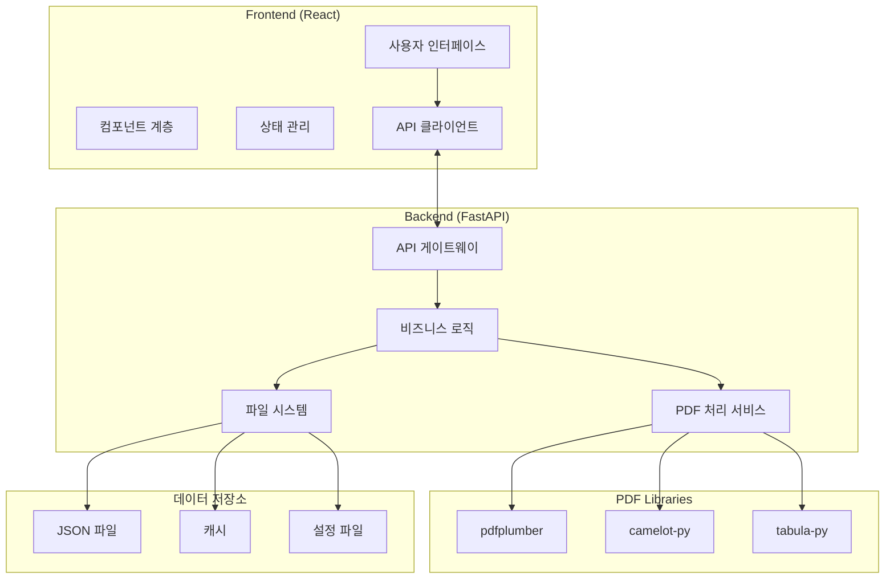
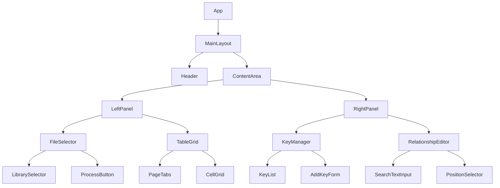
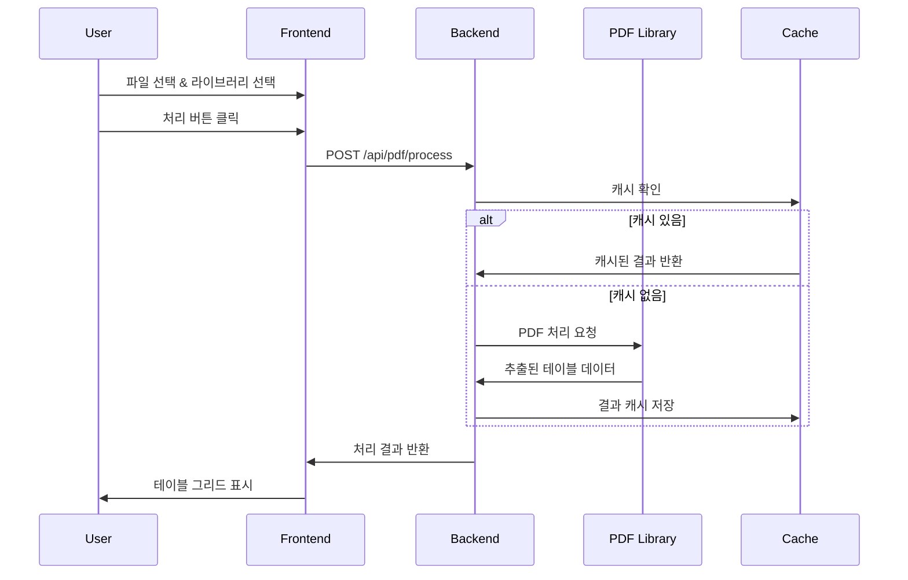
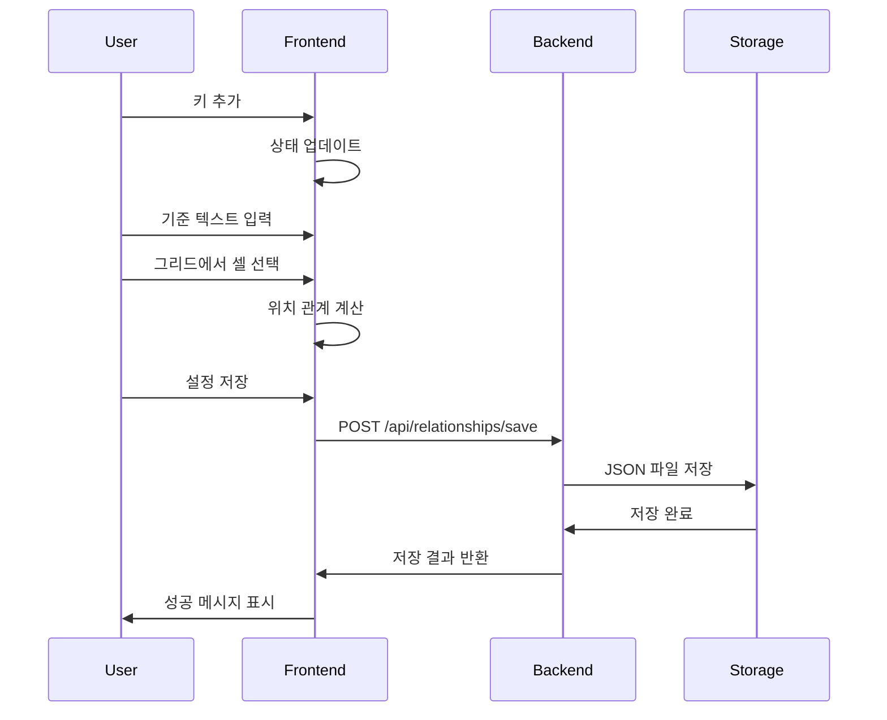

# 기술 명세서

## 🏗️ 시스템 아키텍처

### 전체 구조도



## 🔧 백엔드 아키텍처

### 디렉토리 구조
```
backend/
├── main.py                 # FastAPI 애플리케이션 진입점
├── config.py              # 설정 관리
├── requirements.txt       # Python 의존성
├── api/
│   ├── __init__.py
│   ├── endpoints/
│   │   ├── __init__.py
│   │   ├── pdf.py         # PDF 관련 엔드포인트
│   │   ├── files.py       # 파일 관리 엔드포인트
│   │   └── relationships.py # 관계 설정 엔드포인트
│   └── dependencies.py    # 의존성 주입
├── models/
│   ├── __init__.py
│   ├── pdf_models.py      # PDF 데이터 모델
│   ├── relationship_models.py # 관계 설정 모델
│   └── response_models.py # API 응답 모델
├── services/
│   ├── __init__.py
│   ├── pdf_service.py     # PDF 처리 서비스
│   ├── file_service.py    # 파일 관리 서비스
│   └── relationship_service.py # 관계 설정 서비스
└── utils/
    ├── __init__.py
    ├── pdf_extractors.py  # PDF 추출 유틸리티
    ├── file_utils.py      # 파일 유틸리티
    └── cache_utils.py     # 캐시 관리
```

### 핵심 API 엔드포인트

#### 1. PDF 처리 API
```python
POST /api/pdf/process
Content-Type: application/json

Request:
{
    "file_name": "document.pdf",
    "library": "pdfplumber",  # pdfplumber, camelot, tabula
    "options": {
        "page_range": [1, 5],  # 선택적
        "table_settings": {}   # 라이브러리별 설정
    }
}

Response:
{
    "status": "success",
    "data": {
        "file_id": "abc123",
        "file_name": "document.pdf",
        "total_pages": 5,
        "total_tables": 12,
        "extraction_time": "2.34s",
        "library_used": "pdfplumber",
        "pages": [
            {
                "page_number": 1,
                "tables": [
                    {
                        "table_id": "table_1_0",
                        "rows": 5,
                        "cols": 3,
                        "data": [
                            ["헤더1", "헤더2", "헤더3"],
                            ["값1", "값2", "값3"]
                        ],
                        "bbox": [100, 200, 500, 600]  # 테이블 위치
                    }
                ]
            }
        ]
    }
}
```

#### 2. 파일 목록 API
```python
GET /api/v1/files/list

Response:
{
    "files": [
        {
            "file_id": "abc123",
            "file_name": "document1.pdf",
            "file_size": 1024000,
            "file_type": "pdf",
            "created_at": "2025-01-01T10:00:00Z",
            "file_extension": ".pdf"
        }
    ],
    "total_count": 1,
    "message": "파일 목록 조회 성공",
    "page": null,
    "page_size": null,
    "total_pages": null
}
```

#### 3. 관계 설정 API
```python
POST /api/relationships/save
Content-Type: application/json

Request:
{
    "name": "hospital_mapping",
    "description": "병원 문서 매핑 설정",
    "keys": {
        "hospital_name": {
            "search_text": "병원명",
            "position": {
                "type": "relative",
                "offset": {"row": 0, "col": 1}
            }
        },
        "patient_name": {
            "search_text": "환자명",
            "position": {
                "type": "same_row",
                "offset": {"col": 2}
            }
        }
    }
}

Response:
{
    "status": "success",
    "data": {
        "id": "rel_123",
        "saved_at": "2025-01-01T10:00:00Z"
    }
}
```

### 데이터 모델

#### PDF 데이터 모델
```python
from pydantic import BaseModel
from typing import List, Dict, Any, Optional

class TableBoundingBox(BaseModel):
    x1: float
    y1: float
    x2: float
    y2: float

class TableData(BaseModel):
    table_id: str
    rows: int
    cols: int
    data: List[List[str]]
    bbox: Optional[TableBoundingBox]
    confidence: Optional[float]

class PageData(BaseModel):
    page_number: int
    tables: List[TableData]
    page_width: float
    page_height: float

class PDFProcessResult(BaseModel):
    file_id: str
    file_name: str
    file_path: str
    total_pages: int
    total_tables: int
    extraction_time: float
    library_used: str
    pages: List[PageData]
    metadata: Dict[str, Any]
```

#### 관계 설정 모델
```python
class PositionOffset(BaseModel):
    row: int = 0
    col: int = 0

class Position(BaseModel):
    type: str  # "relative", "same_row", "same_col", "absolute"
    offset: PositionOffset
    direction: Optional[str] = None  # "right", "left", "up", "down"

class KeyMapping(BaseModel):
    search_text: str
    position: Position
    validation_pattern: Optional[str] = None
    required: bool = True

class RelationshipConfig(BaseModel):
    name: str
    description: Optional[str] = ""
    version: str = "1.0"
    keys: Dict[str, KeyMapping]
    created_at: str
    updated_at: str
```

## ⚛️ 프론트엔드 아키텍처

### 디렉토리 구조
```
frontend/
├── public/
│   ├── index.html
│   └── favicon.ico
├── src/
│   ├── components/
│   │   ├── common/          # 공통 컴포넌트
│   │   │   ├── Button.js
│   │   │   ├── Input.js
│   │   │   ├── Card.js
│   │   │   └── Modal.js
│   │   ├── layout/          # 레이아웃 컴포넌트
│   │   │   ├── Header.js
│   │   │   ├── Sidebar.js
│   │   │   └── MainLayout.js
│   │   ├── pdf/             # PDF 관련 컴포넌트
│   │   │   ├── FileSelector.js
│   │   │   ├── LibrarySelector.js
│   │   │   └── ProcessButton.js
│   │   ├── table/           # 테이블 관련 컴포넌트
│   │   │   ├── TableGrid.js
│   │   │   ├── PageTabs.js
│   │   │   └── CellSelector.js
│   │   └── relationship/    # 관계 설정 컴포넌트
│   │       ├── KeyManager.js
│   │       ├── RelationshipEditor.js
│   │       └── ConfigSaver.js
│   ├── services/
│   │   ├── api.js           # API 클라이언트
│   │   ├── pdfService.js    # PDF 관련 서비스
│   │   └── relationshipService.js
│   ├── hooks/
│   │   ├── useApi.js        # API 호출 훅
│   │   ├── usePdfData.js    # PDF 데이터 관리 훅
│   │   └── useRelationships.js
│   ├── utils/
│   │   ├── constants.js     # 상수 정의
│   │   ├── helpers.js       # 헬퍼 함수
│   │   └── validators.js    # 검증 함수
│   ├── styles/
│   │   ├── globals.css      # 전역 스타일
│   │   ├── variables.css    # CSS 변수
│   │   └── components.css   # 컴포넌트 스타일
│   ├── App.js
│   └── index.js
└── package.json
```

### 상태 관리 구조

```javascript
// 전역 상태 구조
const AppState = {
  pdf: {
    currentFile: null,
    selectedLibrary: 'pdfplumber',
    processedData: null,
    isProcessing: false,
    error: null
  },
  table: {
    currentPage: 1,
    selectedTable: 0,
    selectedCells: [],
    gridData: []
  },
  relationship: {
    currentConfig: null,
    savedConfigs: [],
    editingKey: null,
    isEditing: false
  },
  ui: {
    loading: false,
    notifications: [],
    modals: {
      saveConfig: false,
      loadConfig: false
    }
  }
};
```

### 컴포넌트 구조



## 🔄 데이터 플로우

### PDF 처리 플로우


### 관계 설정 플로우


## 🔧 개발 환경 설정

### 백엔드 설정
```bash
# 가상환경 생성
python -m venv venv
source venv/bin/activate  # Windows: venv\Scripts\activate

# 의존성 설치
pip install fastapi uvicorn pdfplumber camelot-py[cv] tabula-py pandas

# 개발 서버 실행
uvicorn main:app --reload --port 8000
```

### 프론트엔드 설정
```bash
# React 앱 생성
npx create-react-app frontend
cd frontend

# 추가 의존성 설치
npm install axios styled-components react-router-dom

# 개발 서버 실행
npm start
```

### 환경 변수
```bash
# .env
BACKEND_URL=http://localhost:8000
UPLOAD_MAX_SIZE=10MB
CACHE_DURATION=3600
PDF_LIBRARIES=pdfplumber,camelot,tabula
```

## 🧪 테스트 전략

### 백엔드 테스트
```python
# pytest 사용
# tests/test_pdf_service.py
import pytest
from services.pdf_service import PDFService

class TestPDFService:
    def test_extract_tables_pdfplumber(self):
        service = PDFService()
        result = service.extract_tables("test.pdf", "pdfplumber")
        assert result.total_tables > 0
        
    def test_cache_functionality(self):
        # 캐시 테스트
        pass
```

### 프론트엔드 테스트
```javascript
// Jest + React Testing Library
// components/__tests__/TableGrid.test.js
import { render, screen } from '@testing-library/react';
import TableGrid from '../TableGrid';

test('renders table grid with data', () => {
  const mockData = {
    pages: [{ tables: [{ data: [['A', 'B'], ['1', '2']] }] }]
  };
  
  render(<TableGrid data={mockData} />);
  expect(screen.getByText('A')).toBeInTheDocument();
});
```

## 📊 성능 최적화

### 백엔드 최적화
- PDF 처리 결과 캐싱
- 비동기 처리로 응답 속도 개선
- 메모리 효율적인 대용량 파일 처리

### 프론트엔드 최적화
- React.memo를 통한 불필요한 리렌더링 방지
- 가상화된 그리드로 대용량 테이블 처리
- 지연 로딩으로 초기 로딩 시간 단축

### 메모리 관리
- PDF 처리 후 메모리 해제
- 캐시 크기 제한 및 자동 정리
- 대용량 파일 스트리밍 처리
