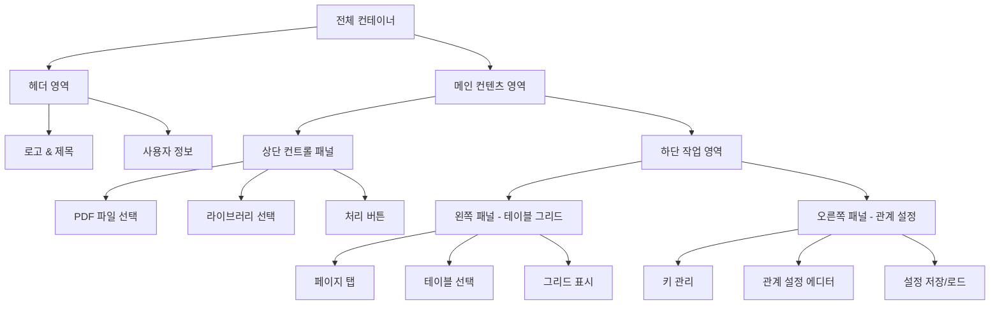
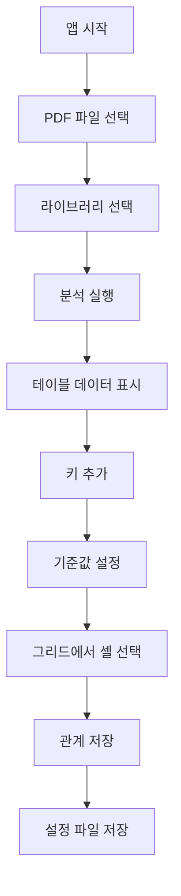
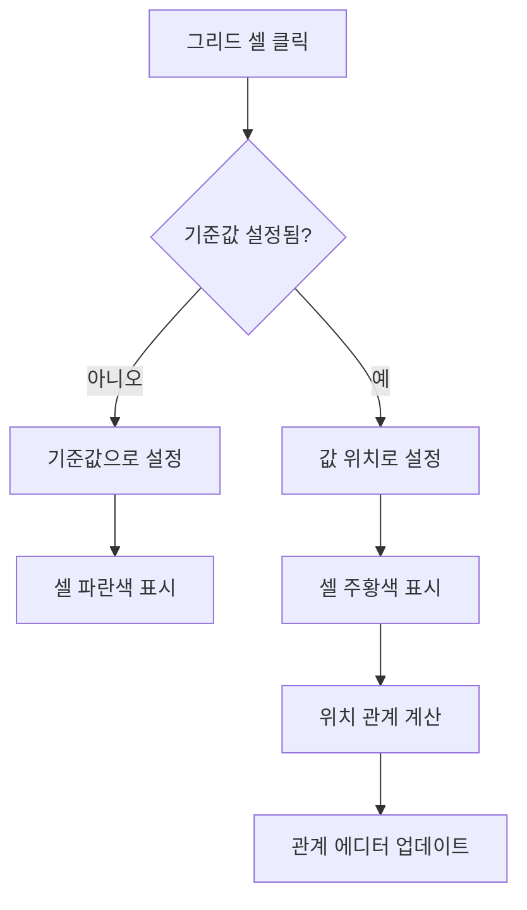

# UI 와이어프레임 및 화면 설계

## 🖼️ 전체 레이아웃 구조

### 메인 레이아웃


## 📐 상세 화면 구성

### 1. 헤더 영역 (Height: 60px)
```
┌─────────────────────────────────────────────────────────────┐
│ 🔍 PDF Table Analyzer              [도움말] [설정] [정보]    │
└─────────────────────────────────────────────────────────────┘
```

**구성 요소:**
- 좌측: 로고 및 애플리케이션 제목
- 우측: 유틸리티 버튼들 (도움말, 설정, 정보)

### 2. 상단 컨트롤 패널 (Height: 80px)
```
┌─────────────────────────────────────────────────────────────┐
│  PDF 파일 선택          라이브러리 선택         처리 상태      │
│ ┌─────────────────┐   ┌─────────────────┐   ┌─────────────┐ │
│ │ document1.pdf ▼ │   │ ○ pdfplumber    │   │ [📊 분석시작] │ │
│ └─────────────────┘   │ ○ camelot      │   └─────────────┘ │
│                       │ ○ tabula       │                   │
│                       └─────────────────┘                   │
└─────────────────────────────────────────────────────────────┘
```

**구성 요소:**
- **PDF 파일 선택**: 드롭다운 형태로 samples 폴더 내 파일 목록
- **라이브러리 선택**: 라디오 버튼으로 3가지 라이브러리 선택
- **처리 버튼**: 선택된 설정으로 PDF 분석 실행

### 3. 메인 작업 영역

#### 3-1. 왼쪽 패널 - 테이블 그리드 (Width: 60%)
```
┌─────────────────────────────────────────────────────────────┐
│ 📊 테이블 데이터                                           │
├─────────────────────────────────────────────────────────────┤
│ [페이지1] [페이지2] [페이지3] [페이지4]    테이블: [1/3 ▼]   │
├─────────────────────────────────────────────────────────────┤
│ │   │ A  │ B  │ C  │ D  │ E  │ F  │ G  │ H  │             │
│ ├───┼────┼────┼────┼────┼────┼────┼────┼────┤             │
│ │ 1 │병원명│환자명│진료일│진료과│의사명│금액 │비고 │증상   │ │
│ ├───┼────┼────┼────┼────┼────┼────┼────┼────┤             │
│ │ 2 │서울병원│김철수│2024-01-01│내과│홍길동│50000│보험│두통│ │
│ ├───┼────┼────┼────┼────┼────┼────┼────┼────┤             │
│ │ 3 │부산병원│이영희│2024-01-02│외과│이순신│75000│자비│골절│ │
│ ├───┼────┼────┼────┼────┼────┼────┼────┼────┤             │
│ │ 4 │대구병원│박민수│2024-01-03│안과│강감찬│30000│보험│근시│ │
│ └───┴────┴────┴────┴────┴────┴────┴────┴────┘             │
└─────────────────────────────────────────────────────────────┘
```

**기능:**
- **페이지 탭**: 각 페이지별 전환
- **테이블 선택**: 페이지 내 여러 테이블 중 선택
- **그리드 표시**: 
  - 행/열 번호 표시
  - 셀 클릭으로 선택 가능
  - 선택된 셀 하이라이트 (주황색)
  - 기준값 셀 하이라이트 (파란색)

#### 3-2. 오른쪽 패널 - 관계 설정 (Width: 40%)

##### 키 관리 영역
```
┌─────────────────────────────────────────────┐
│ ⚙️ 키 관리                                  │
├─────────────────────────────────────────────┤
│ ┌─────────────────────┐ [➕ 새 키 추가]      │
│ │ 새 키 이름          │                     │
│ └─────────────────────┘                     │
├─────────────────────────────────────────────┤
│ 📋 등록된 키 목록                           │
│                                             │
│ ✓ hospital_name    [편집] [삭제]            │
│   └ 상태: 설정 완료                         │
│                                             │
│ ⚠ patient_name     [편집] [삭제]            │
│   └ 상태: 기준값 미설정                     │
│                                             │
│ ○ doctor_name      [편집] [삭제]            │
│   └ 상태: 설정 중                           │
└─────────────────────────────────────────────┘
```

##### 관계 설정 에디터
```
┌─────────────────────────────────────────────┐
│ 🎯 관계 설정 에디터                         │
├─────────────────────────────────────────────┤
│ 선택된 키: hospital_name                    │
├─────────────────────────────────────────────┤
│ 1. 기준값 설정                              │
│ ┌─────────────────────┐                     │
│ │ 병원명              │ 🔍                  │
│ └─────────────────────┘                     │
│ 설명: 찾을 기준 텍스트를 입력하세요         │
├─────────────────────────────────────────────┤
│ 2. 값 위치 설정                             │
│ 현재 선택: 없음                             │
│ 💡 왼쪽 그리드에서 값이 있는 셀을 클릭하세요 │
│                                             │
│ 선택된 위치: B1 (병원명 기준 우측 1칸)      │
├─────────────────────────────────────────────┤
│ 3. 고급 설정                                │
│ □ 필수 필드                                 │
│ □ 정규식 검증                               │
│ ┌─────────────────────┐                     │
│ │ 검증 패턴 (선택사항)  │                     │
│ └─────────────────────┘                     │
└─────────────────────────────────────────────┘
```

##### 설정 관리 영역
```
┌─────────────────────────────────────────────┐
│ 💾 설정 파일 관리                           │
├─────────────────────────────────────────────┤
│ 현재 설정: hospital_mapping.json           │
│                                             │
│ [💾 저장] [📁 불러오기] [🗑️ 초기화]        │
├─────────────────────────────────────────────┤
│ 📁 저장된 설정 목록                         │
│                                             │
│ • hospital_mapping.json (2024-01-01)       │
│ • patient_records.json (2024-01-02)        │
│ • medical_reports.json (2024-01-03)        │
│                                             │
│ [📂 폴더 열기]                              │
└─────────────────────────────────────────────┘
```

## 🎨 상태별 UI 변화

### 1. 초기 로딩 상태
```
┌─────────────────────────────────────────────────────────────┐
│ PDF Table Analyzer                                          │
├─────────────────────────────────────────────────────────────┤
│  PDF 파일 선택          라이브러리 선택                      │
│ ┌─────────────────┐   ┌─────────────────┐                   │
│ │ 파일을 선택하세요 │   │ ○ pdfplumber    │   [분석 시작]     │
│ └─────────────────┘   │ ○ camelot      │                   │
│                       │ ○ tabula       │                   │
│                       └─────────────────┘                   │
├─────────────────────────────────────────────────────────────┤
│               💡 PDF 파일을 선택하고 분석을 시작하세요        │
└─────────────────────────────────────────────────────────────┘
```

### 2. 처리 중 상태
```
┌─────────────────────────────────────────────────────────────┐
│ PDF Table Analyzer                                          │
├─────────────────────────────────────────────────────────────┤
│  PDF 파일 선택          라이브러리 선택                      │
│ ┌─────────────────┐   ┌─────────────────┐                   │
│ │ document1.pdf   │   │ ● pdfplumber    │   [⏳ 처리 중]    │
│ └─────────────────┘   │ ○ camelot      │                   │
│                       │ ○ tabula       │                   │
│                       └─────────────────┘                   │
├─────────────────────────────────────────────────────────────┤
│            ⏳ PDF를 분석하고 있습니다... (23%)               │
│            ████████░░░░░░░░░░░░░░░░                         │
└─────────────────────────────────────────────────────────────┘
```

### 3. 셀 선택 상태
```
┌─────────────────────────────────────────────────────────────┐
│ │   │ A  │ B       │ C        │ D     │ E    │             │
│ ├───┼────┼─────────┼──────────┼───────┼──────┤             │
│ │ 1 │병원명│🔍환자명   │진료일     │진료과  │의사명 │             │
│ ├───┼────┼─────────┼──────────┼───────┼──────┤             │
│ │ 2 │서울병원│🟠김철수   │2024-01-01│내과   │홍길동 │             │
│ └───┴────┴─────────┴──────────┴───────┴──────┘             │
│                                                             │
│ 💡 기준값 "병원명"에서 우측 1칸 → 환자명으로 설정됩니다     │
└─────────────────────────────────────────────────────────────┘
```

**색상 코딩:**
- 🔍 파란색: 기준값이 있는 셀
- 🟠 주황색: 선택된 값 셀
- 회색: 일반 셀

## 📱 반응형 디자인

### 데스크톱 (> 1024px)
- 좌우 분할 레이아웃 (60% : 40%)
- 모든 기능 표시
- 풀 그리드 표시

### 태블릿 (768px - 1024px)
- 좌우 분할 레이아웃 유지
- 그리드 스크롤 표시
- 컨트롤 패널 세로 배치

### 모바일 (< 768px)
```
┌─────────────────────┐
│ PDF Table Analyzer  │
├─────────────────────┤
│ [파일선택] [라이브러리] │
│ [분석시작]           │
├─────────────────────┤
│ [테이블] [관계설정]   │
├─────────────────────┤
│ 선택된 탭 내용 표시   │
│                     │
│                     │
└─────────────────────┘
```

- 탭 기반 네비게이션
- 세로 스택 레이아웃
- 터치 최적화 인터페이스

## 🎯 사용자 인터랙션 플로우

### 1. 기본 워크플로우


### 2. 셀 선택 인터랙션


### 3. 키보드 단축키
- **Tab**: 다음 입력 필드로 이동
- **Enter**: 현재 작업 실행 (분석 시작, 키 추가 등)
- **방향키**: 그리드 내 셀 네비게이션
- **Space**: 셀 선택/해제
- **Ctrl+S**: 설정 저장
- **Ctrl+L**: 설정 로드
- **Escape**: 모달 닫기/선택 해제

## 🔔 피드백 및 알림

### 1. 토스트 알림
```
┌─────────────────────────────────┐
│ ✅ 설정이 성공적으로 저장되었습니다  │
└─────────────────────────────────┘
```

### 2. 진행률 표시
```
⏳ PDF 처리 중... (75%)
████████████████████░░░░░
페이지 3/4 처리 완료
```

### 3. 에러 메시지
```
┌─────────────────────────────────┐
│ ❌ PDF 파일을 읽을 수 없습니다     │
│    파일이 손상되었거나 암호화된    │
│    파일일 수 있습니다.           │
│    [다시 시도] [다른 파일 선택]    │
└─────────────────────────────────┘
```

## 🎨 시각적 가이드라인

### 간격 및 여백
- **카드 패딩**: 24px
- **섹션 간격**: 32px
- **버튼 간격**: 16px
- **입력 필드 높이**: 44px

### 애니메이션
- **페이드 인**: 0.3초
- **슬라이드**: 0.2초
- **호버 효과**: 0.15초
- **로딩 스피너**: 1초 회전

### 아이콘 시스템
- **크기**: 16px, 20px, 24px
- **스타일**: Outline 기본, Solid 강조
- **색상**: 텍스트 색상과 동일

이 와이어프레임을 기반으로 실제 구현을 진행하겠습니다.
