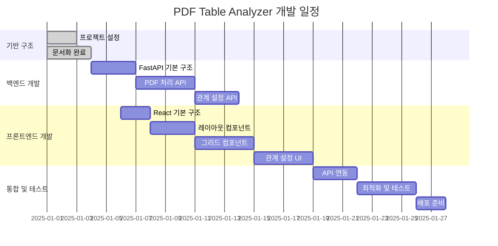

ㅇ해# 개발 계획 및 실행 가이드

## 🗓️ 개발 일정

### 전체 개발 스케줄 (5주)



## 📋 단계별 개발 계획

### Phase 1: 프로젝트 기반 구조 (1-3일차)

#### ✅ 완료된 작업
- [x] 프로젝트 문서화
- [x] 기술 스택 선정
- [x] 아키텍처 설계
- [x] UI/UX 와이어프레임

#### 📋 다음 작업
1. **프로젝트 폴더 구조 생성**
   ```bash
   mkdir -p backend/api/endpoints backend/models backend/services backend/utils
   mkdir -p frontend/src/components frontend/src/services frontend/src/hooks
   mkdir -p samples relationships
   ```

2. **백엔드 기본 설정**
   - FastAPI 프로젝트 초기화
   - requirements.txt 작성
   - 기본 라우터 설정

3. **프론트엔드 기본 설정**
   - React 앱 초기화
   - 필요한 패키지 설치
   - 기본 컴포넌트 구조 생성

### Phase 2: 백엔드 API 개발 (4-10일차)

#### 2-1. FastAPI 기본 구조 (4-6일차)
```python
# backend/main.py
from fastapi import FastAPI
from fastapi.middleware.cors import CORSMiddleware
from api.endpoints import pdf, files, relationships

app = FastAPI(title="PDF Table Analyzer API")

# CORS 설정
app.add_middleware(
    CORSMiddleware,
    allow_origins=["http://localhost:3000"],
    allow_credentials=True,
    allow_methods=["*"],
    allow_headers=["*"],
)

# 라우터 등록
app.include_router(pdf.router, prefix="/api/pdf", tags=["pdf"])
app.include_router(files.router, prefix="/api/files", tags=["files"])
app.include_router(relationships.router, prefix="/api/relationships", tags=["relationships"])
```

#### 2-2. PDF 처리 서비스 구현 (7-10일차)
- [x] 3가지 라이브러리 통합
- [ ] 캐시 시스템 구현
- [ ] 에러 처리 강화
- [ ] 성능 최적화

#### 2-3. 관계 설정 API (11-13일차)
- [ ] JSON 파일 저장/로드
- [ ] 관계 설정 검증
- [ ] 버전 관리 시스템

### Phase 3: 프론트엔드 개발 (6-18일차)

#### 3-1. 기본 레이아웃 (6-10일차)
```javascript
// frontend/src/App.js
import React from 'react';
import MainLayout from './components/layout/MainLayout';
import ControlPanel from './components/ControlPanel';
import WorkArea from './components/WorkArea';

function App() {
  return (
    <MainLayout>
      <ControlPanel />
      <WorkArea />
    </MainLayout>
  );
}
```

#### 3-2. 테이블 그리드 컴포넌트 (11-14일차)
```javascript
// frontend/src/components/table/TableGrid.js
import React, { useState, useCallback } from 'react';

const TableGrid = ({ data, onCellSelect }) => {
  const [selectedCells, setSelectedCells] = useState([]);
  
  const handleCellClick = useCallback((row, col) => {
    const cellId = `${row}-${col}`;
    setSelectedCells(prev => [...prev, cellId]);
    onCellSelect({ row, col, value: data[row][col] });
  }, [data, onCellSelect]);
  
  return (
    <div className="table-grid">
      {/* 그리드 렌더링 로직 */}
    </div>
  );
};
```

#### 3-3. 관계 설정 UI (15-18일차)
- [ ] 키 관리 컴포넌트
- [ ] 관계 에디터 컴포넌트
- [ ] 설정 저장/로드 UI

### Phase 4: 통합 및 최적화 (19-28일차)

#### 4-1. API 연동 (19-21일차)
```javascript
// frontend/src/services/api.js
const API_BASE_URL = 'http://localhost:8000/api';

export const pdfService = {
  async processFile(fileName, library) {
    const response = await fetch(`${API_BASE_URL}/pdf/process`, {
      method: 'POST',
      headers: { 'Content-Type': 'application/json' },
      body: JSON.stringify({ file_name: fileName, library })
    });
    return response.json();
  }
};
```

#### 4-2. 성능 최적화 (22-25일차)
- [ ] React.memo 적용
- [ ] 가상화된 그리드
- [ ] 디바운싱 적용
- [ ] 로딩 상태 최적화

#### 4-3. 테스트 및 디버깅 (26-28일차)
- [ ] 단위 테스트 작성
- [ ] 통합 테스트
- [ ] 사용자 시나리오 테스트
- [ ] 브라우저 호환성 테스트

## 🔧 개발 환경 설정

### 1. 로컬 개발 환경
```bash
# 1. 프로젝트 루트에서
git init
git add .
git commit -m "Initial project setup"

# 2. 백엔드 환경 설정
cd backend
python -m venv venv
source venv/bin/activate  # Windows: venv\Scripts\activate
pip install -r requirements.txt

# 3. 프론트엔드 환경 설정
cd ../frontend
npm install

# 4. 개발 서버 실행 (터미널 2개)
# 터미널 1: 백엔드
cd backend && uvicorn main:app --reload

# 터미널 2: 프론트엔드  
cd frontend && npm start
```

### 2. 필수 패키지 설치

#### 백엔드 requirements.txt
```txt
fastapi==0.104.1
uvicorn[standard]==0.24.0
pdfplumber==0.10.3
camelot-py[cv]==0.10.1
tabula-py==2.8.2
pandas==2.1.3
pydantic==2.5.0
python-multipart==0.0.6
aiofiles==23.2.1
```

#### 프론트엔드 package.json 추가 의존성
```json
{
  "dependencies": {
    "axios": "^1.6.0",
    "styled-components": "^6.1.0",
    "react-router-dom": "^6.18.0",
    "react-virtualized": "^9.22.5",
    "lodash.debounce": "^4.0.8"
  },
  "devDependencies": {
    "@testing-library/react": "^13.4.0",
    "@testing-library/jest-dom": "^5.16.5",
    "@testing-library/user-event": "^14.5.0"
  }
}
```

## 🧪 테스트 전략

### 1. 백엔드 테스트
```python
# tests/test_pdf_service.py
import pytest
from fastapi.testclient import TestClient
from main import app

client = TestClient(app)

def test_process_pdf():
    response = client.post("/api/pdf/process", json={
        "file_name": "test.pdf",
        "library": "pdfplumber"
    })
    assert response.status_code == 200
    assert "data" in response.json()
```

### 2. 프론트엔드 테스트
```javascript
// src/components/__tests__/TableGrid.test.js
import { render, screen, fireEvent } from '@testing-library/react';
import TableGrid from '../table/TableGrid';

test('renders table and handles cell selection', () => {
  const mockData = [['A', 'B'], ['1', '2']];
  const mockOnCellSelect = jest.fn();
  
  render(<TableGrid data={mockData} onCellSelect={mockOnCellSelect} />);
  
  const cell = screen.getByText('A');
  fireEvent.click(cell);
  
  expect(mockOnCellSelect).toHaveBeenCalledWith({
    row: 0, col: 0, value: 'A'
  });
});
```

## 📊 품질 관리

### 1. 코드 품질
- **Linting**: ESLint (프론트엔드), flake8 (백엔드)
- **Formatting**: Prettier (프론트엔드), black (백엔드)
- **Type Checking**: TypeScript 적용 고려

### 2. 성능 모니터링
```javascript
// 성능 측정 예시
const performanceTimer = {
  start: (label) => console.time(label),
  end: (label) => console.timeEnd(label)
};

// PDF 처리 시간 측정
performanceTimer.start('PDF Processing');
const result = await pdfService.processFile(fileName, library);
performanceTimer.end('PDF Processing');
```

### 3. 에러 처리
```python
# backend/utils/error_handlers.py
from fastapi import HTTPException

class PDFProcessingError(HTTPException):
    def __init__(self, detail: str):
        super().__init__(status_code=422, detail=f"PDF 처리 오류: {detail}")

class FileNotFoundError(HTTPException):
    def __init__(self, filename: str):
        super().__init__(status_code=404, detail=f"파일을 찾을 수 없습니다: {filename}")
```

## 🚀 배포 전략

### 1. 로컬 배포 (개발용)
```bash
# Docker Compose (향후 적용)
version: '3.8'
services:
  backend:
    build: ./backend
    ports:
      - "8000:8000"
    volumes:
      - ./samples:/app/samples
      - ./relationships:/app/relationships
  
  frontend:
    build: ./frontend
    ports:
      - "3000:3000"
    depends_on:
      - backend
```

### 2. 프로덕션 배포 고려사항
- **환경 변수 관리**: .env 파일 사용
- **정적 파일 서빙**: nginx 설정
- **로그 관리**: 구조화된 로깅
- **모니터링**: 헬스체크 엔드포인트

## 📈 향후 개선사항

### 1. 기능 확장
- [ ] 다중 PDF 파일 배치 처리
- [ ] AI 기반 자동 관계 설정 추천
- [ ] 데이터 내보내기 (Excel, CSV)
- [ ] 관계 설정 템플릿 공유

### 2. 기술적 개선
- [ ] TypeScript 적용
- [ ] PWA (Progressive Web App) 변환
- [ ] 오프라인 지원
- [ ] 실시간 협업 기능

### 3. 사용자 경험 개선
- [ ] 드래그 앤 드롭 파일 업로드
- [ ] 키보드 단축키 확장
- [ ] 다국어 지원
- [ ] 다크 모드 지원

## ✅ 체크리스트

### 개발 시작 전 확인사항
- [ ] Python 3.9+ 설치 확인
- [ ] Node.js 16+ 설치 확인
- [ ] Git 설정 완료
- [ ] IDE 확장 프로그램 설치
- [ ] 테스트 PDF 파일 준비

### 각 단계별 완료 기준
- [ ] 백엔드 API 테스트 통과
- [ ] 프론트엔드 컴포넌트 단위 테스트 통과
- [ ] 통합 테스트 시나리오 완료
- [ ] 성능 기준 충족 (PDF 처리 5초 이내)
- [ ] 문서화 업데이트 완료

이제 이 계획에 따라 실제 개발을 시작하겠습니다!
