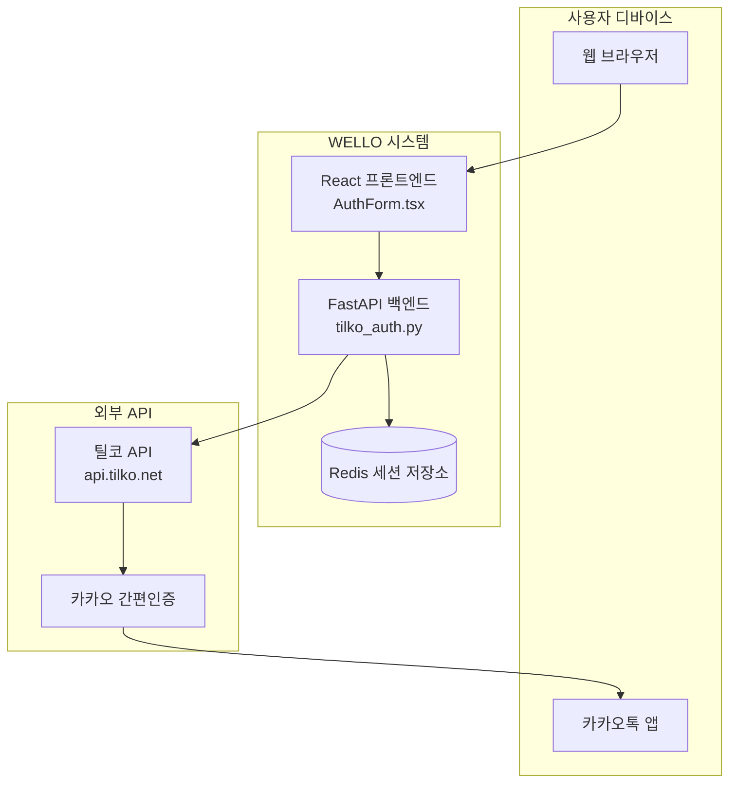
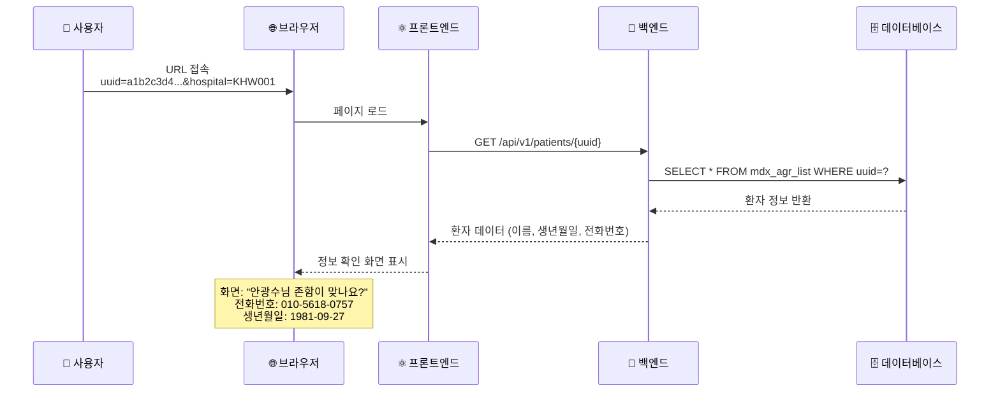
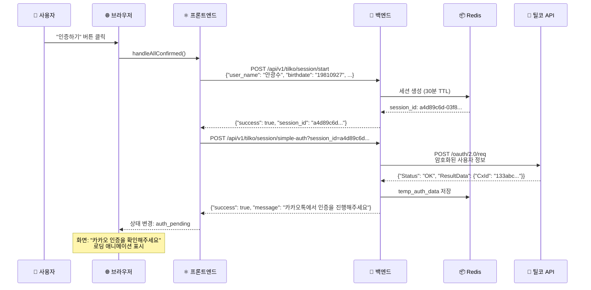
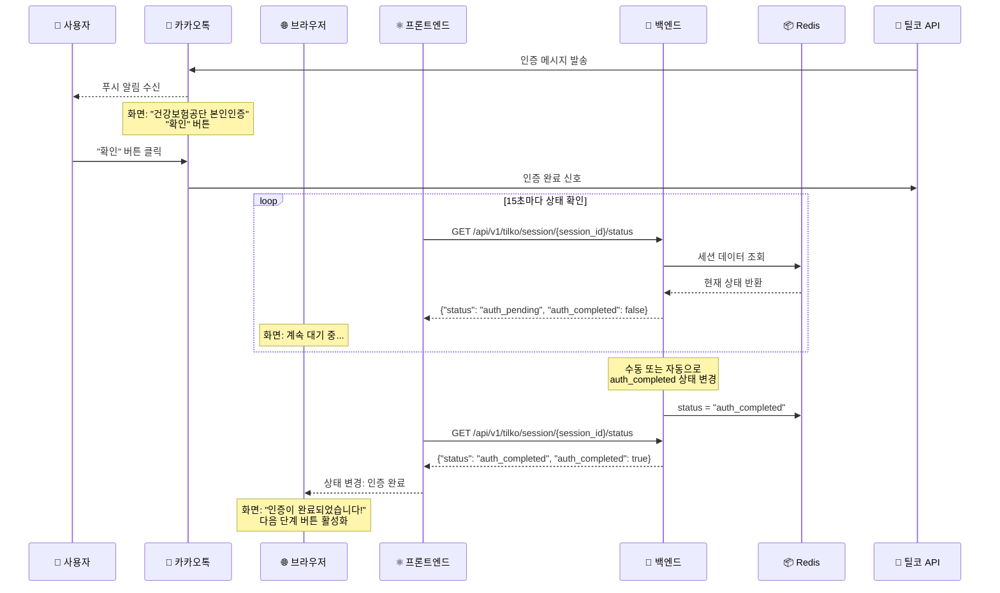
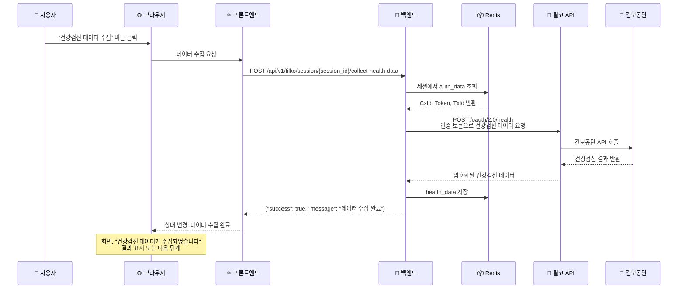
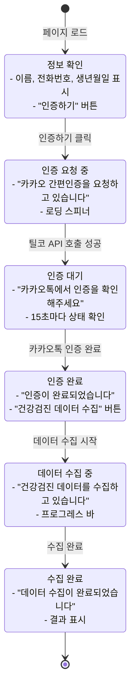
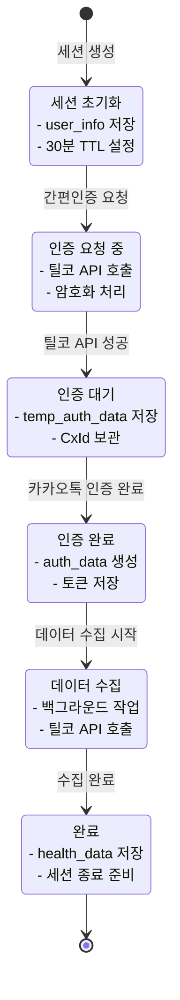
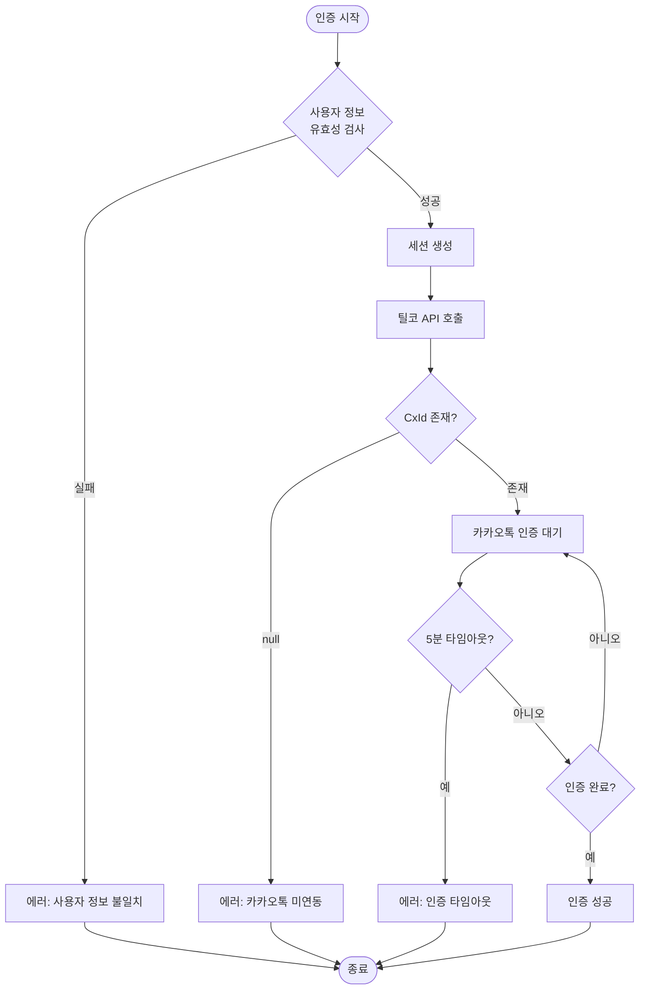

# 틸코 인증 시스템 단계별 플로우 도식화

## 전체 시스템 아키텍처



## 단계별 상세 플로우

### 1단계: 초기 접속 및 정보 확인



### 2단계: 세션 생성 및 틸코 인증 요청



### 3단계: 카카오톡 인증 및 상태 모니터링



### 4단계: 건강검진 데이터 수집



## 화면별 상태 변화

### 프론트엔드 화면 상태



### 백엔드 세션 상태



## 에러 처리 및 예외 상황

### 주요 에러 케이스



## 데이터 저장 구조

### Redis 세션 데이터 구조

```json
{
  "session_id": "a4d89c6d-03f8-41d3-872d-4d0c0fd662e8",
  "user_info": {
    "name": "안광수",
    "birthdate": "19810927",
    "phone_no": "01056180757",
    "gender": "M"
  },
  "status": "auth_completed",
  "created_at": "2025-10-14T17:10:24.168868",
  "updated_at": "2025-10-14T17:12:26.213091",
  "expires_at": "2025-10-14T17:40:24.168868",
  "temp_auth_data": {
    "cxId": "133abc2743-4ec1-4fd7-8aa8-89308fbf7a5b",
    "privateAuthType": "0",
    "reqTxId": "b3225489b85246c6959ed530ad31bc5eezaay5u4",
    "token": "eyJhbGciOiJIUzI1NiJ9...",
    "txId": "b3225489b85246c6959ed530ad31bc5eezaay5u4"
  },
  "auth_data": {
    "CxId": "133abc2743-4ec1-4fd7-8aa8-89308fbf7a5b",
    "PrivateAuthType": "0",
    "ReqTxId": "b3225489b85246c6959ed530ad31bc5eezaay5u4",
    "Token": "eyJhbGciOiJIUzI1NiJ9...",
    "TxId": "b3225489b85246c6959ed530ad31bc5eezaay5u4"
  },
  "health_data": null,
  "prescription_data": null,
  "progress": {
    "auth_requested": false,
    "auth_completed": true,
    "health_data_fetched": false,
    "prescription_data_fetched": false,
    "completed": false
  },
  "messages": [
    {
      "timestamp": "2025-10-14T17:10:24.168868",
      "type": "info",
      "message": "안광수님의 인증 세션이 시작되었습니다."
    },
    {
      "timestamp": "2025-10-14T17:12:26.213113",
      "type": "info",
      "message": "인증이 완료되었습니다. 건강검진 데이터를 수집할 수 있습니다."
    }
  ]
}
```

## API 엔드포인트 매핑

| 단계 | 프론트엔드 액션 | 백엔드 API | 설명 |
|------|----------------|------------|------|
| 1 | 페이지 로드 | `GET /api/v1/patients/{uuid}` | 환자 정보 조회 |
| 2 | 인증 시작 | `POST /api/v1/tilko/session/start` | 세션 생성 |
| 3 | 간편인증 | `POST /api/v1/tilko/session/simple-auth` | 틸코 인증 요청 |
| 4 | 상태 확인 | `GET /api/v1/tilko/session/{id}/status` | 인증 상태 모니터링 |
| 5 | 데이터 수집 | `POST /api/v1/tilko/session/{id}/collect-health-data` | 건강검진 데이터 수집 |

## 보안 고려사항

1. **데이터 암호화**: 틸코 API 통신 시 AES + RSA 이중 암호화
2. **세션 관리**: Redis TTL 30분, 자동 만료
3. **토큰 보안**: JWT 토큰 안전한 저장 및 전송
4. **개인정보 보호**: 민감 정보 암호화 저장
5. **API 보안**: CORS 설정, 인증 헤더 검증

이 도식화를 통해 전체 틸코 인증 시스템의 흐름을 이해하고, 각 단계별 처리 과정을 명확히 파악할 수 있습니다.
