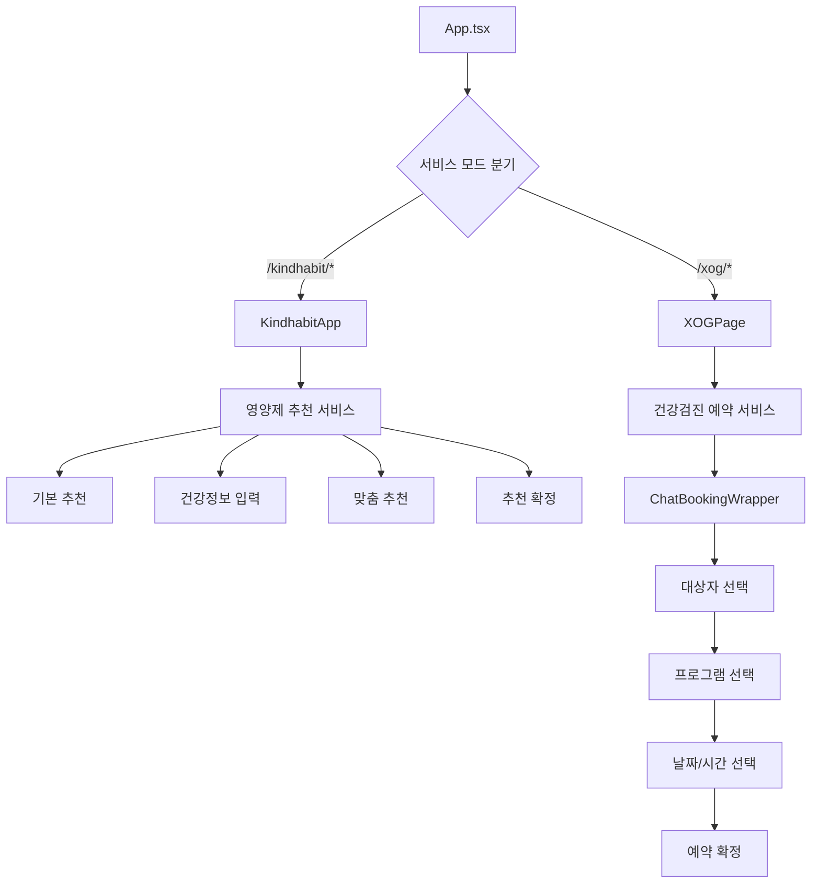
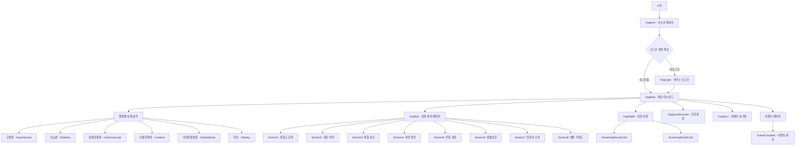
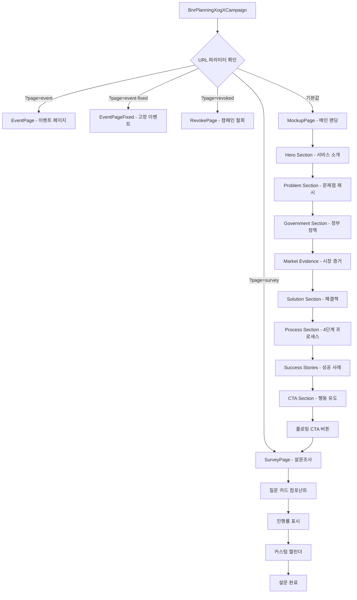

# Reference Projects Overview

## 📁 프로젝트 구조

```
reference/
├── frontend/          # 프론트엔드 프로젝트들
│   ├── kindhabit-fe/           # 통합 헬스케어 플랫폼 (메인)
│   ├── xog-frontend-hyuna/     # XOG 질병예측 웹앱 (레거시)
│   └── bnr_planning_XogX/      # 캠페인 랜딩 컴포넌트
└── backend/           # 백엔드 프로젝트들
    ├── xog-backend-godzilla/   # NestJS GraphQL API 서버
    └── xog-backend-leviathan/  # Python AI/ML 서비스
```

---

## 🎯 Frontend Projects Analysis

### 1. **kindhabit-fe** (메인 플랫폼)
**📋 분류**: 통합 헬스케어 서비스 플랫폼
- **기술 스택**: React 18 + Vite + TypeScript + Recoil + Styled-components
- **아키텍처**: 모던 SPA with 채팅 기반 UX

#### 🔄 화면 흐름도


#### 📱 주요 컴포넌트 구조
- **ChatContainer**: 채팅 UI 메인 컨테이너
- **ChatBubble**: 메시지 표시 컴포넌트  
- **Slider**: 선택형 응답 UI
- **Calendar**: 날짜 선택 컴포넌트
- **Card**: 다용도 카드 컴포넌트

#### 🎨 테마 시스템
- 서비스별 독립적 테마 구성
- 공통 컴포넌트의 스타일 커스터마이징 지원
- 반응형 디자인을 위한 브레이크포인트 시스템

#### 🔧 빌드 모드
```bash
# 개발 모드
npm run dev                    # 기본 모드
npm run dev:supplement         # 영양제 추천 모드
npm run dev:booking           # 예약 서비스 모드

# 빌드 모드  
npm run build:supplement      # 영양제 서비스 빌드
npm run build:booking        # 예약 서비스 빌드
```

---

### 2. **xog-frontend-hyuna** (레거시)
**📋 분류**: XOG 질병예측 웹앱 (기존 운영 서비스)
- **기술 스택**: React + TypeScript + SCSS + React-Query
- **아키텍처**: 전통적인 SPA with HashRouter

#### 🔄 화면 흐름도


#### 📱 주요 페이지 구성
1. **인증 관련**
   - `XogLogin`: 카카오 로그인
   - `RequireAuth`: 인증 가드
   - `Logout`: 로그아웃

2. **메인 서비스**
   - `XogIntro`: 서비스 소개
   - `XogMain`: 질병 위험도 대시보드
   - `XogSub`: 질병별 상세 분석 (8개 섹션)
   - `XogWallet`: 검진 이력 관리

3. **부가 기능**
   - `XogQuestionnaire`: 건강 설문조사
   - `XogSync`: 데이터 동기화
   - `Events`: 이벤트 페이지

4. **시스템 페이지**
   - `Error`: 에러 처리
   - `NoData`: 데이터 없음
   - `NoMatch`: 404 페이지
   - `Policy`: 개인정보처리방침
   - `PrivacyTerms`: 이용약관

---

### 3. **bnr_planning_XogX** (캠페인 컴포넌트)
**📋 분류**: 건강검진 캠페인 랜딩 페이지/컴포넌트
- **기술 스택**: React + TypeScript + SCSS
- **아키텍처**: 모듈화된 캠페인 컴포넌트

#### 🔄 화면 흐름도


#### 🎨 스킨 시스템
- **O 버전 (오렌지)**: Primary `#f59e0b` (기본)
- **B 버전 (파란색)**: Primary `#1d4ed8` (URL: `?skin=B`)
- CSS 변수 기반 테마 전환
- 모바일 최적화 반응형 디자인

#### 🧩 컴포넌트 구조
- **CustomCalendar**: 생년월일 입력 전용
- **ProgressBar**: 설문 진행률 표시
- **QuestionCard**: 설문 질문 카드
- **OptionItem**: 선택 옵션 아이템

#### 🔧 커스텀 훅
- **useCampaignSkin**: 스킨 테마 관리
- **useSurveyData**: 설문 데이터 상태 관리

---

## 🔗 Backend Projects Analysis

### 1. **xog-backend-godzilla** (메인 API 서버)
**📋 분류**: NestJS GraphQL API 서버
- **기술 스택**: NestJS + GraphQL + Apollo + Prisma + TypeScript
- **아키텍처**: 마이크로서비스 지향 모듈화

#### 📡 API 구조
```
src/
├── api/                 # REST API
│   ├── auth/           # 인증 API
│   ├── booking/        # 예약 API  
│   └── report/         # 리포트 API
├── graphql/xog/        # GraphQL 리졸버
│   ├── admin/          # 관리자 기능
│   ├── auth/           # 인증
│   ├── user/           # 사용자 관리
│   ├── document/       # 문서 관리
│   ├── challenge/      # 챌린지
│   ├── purchase/       # 구매
│   └── report/         # 리포트
└── helpers/            # 공통 헬퍼
    ├── guards/         # 인증 가드
    ├── pipes/          # 검증 파이프
    └── interceptors/   # 인터셉터
```

### 2. **xog-backend-leviathan** (AI/ML 서비스)
**📋 분류**: Python AI/ML 서비스
- **기술 스택**: Python + FastAPI + TensorFlow + Airflow
- **아키텍처**: AI 모델 서빙 및 데이터 파이프라인

#### 🤖 AI 서비스 구조
```
├── func/               # AI 모델 함수
│   ├── inference_v1/   # 질병예측 v1
│   ├── inference_v2/   # 질병예측 v2
│   ├── recommendation/ # 추천 엔진
│   └── trend_prediction/ # 트렌드 예측
├── data/               # 학습된 모델
└── airflow/            # 데이터 파이프라인
```

---

## 💡 통합 전략 권장사항

### 🎯 통합 우선순위
1. **1단계**: `bnr_planning_XogX` → `kindhabit-fe` 컴포넌트 통합
2. **2단계**: `xog-frontend-hyuna` 기능을 `kindhabit-fe`로 점진적 마이그레이션  
3. **3단계**: 백엔드 API 통합 및 확장

### 🏗️ 권장 아키텍처
```
통합 플랫폼
├── Frontend (kindhabit-fe 기반 확장)
│   ├── /kindhabit/*    # 영양제 추천
│   ├── /xog/*          # 건강검진 예약
│   ├── /campaign/*     # 캠페인 랜딩
│   └── /analysis/*     # 질병예측 분석 (신규)
└── Backend (xog-backend-godzilla 확장)
    ├── 기존 GraphQL API 유지
    ├── Kindhabit API 추가
    └── Campaign API 추가
```

### ✅ 통합의 이점
- **코드 재사용성 최대화**
- **단일 백엔드로 API 통합** 
- **통합된 인증/권한 시스템**
- **개발/배포 효율성 향상**
- **사용자 경험 통일화**

---

*📅 Last Updated: 2025-09-16*
*🔄 Status: Reference Documentation Complete*
